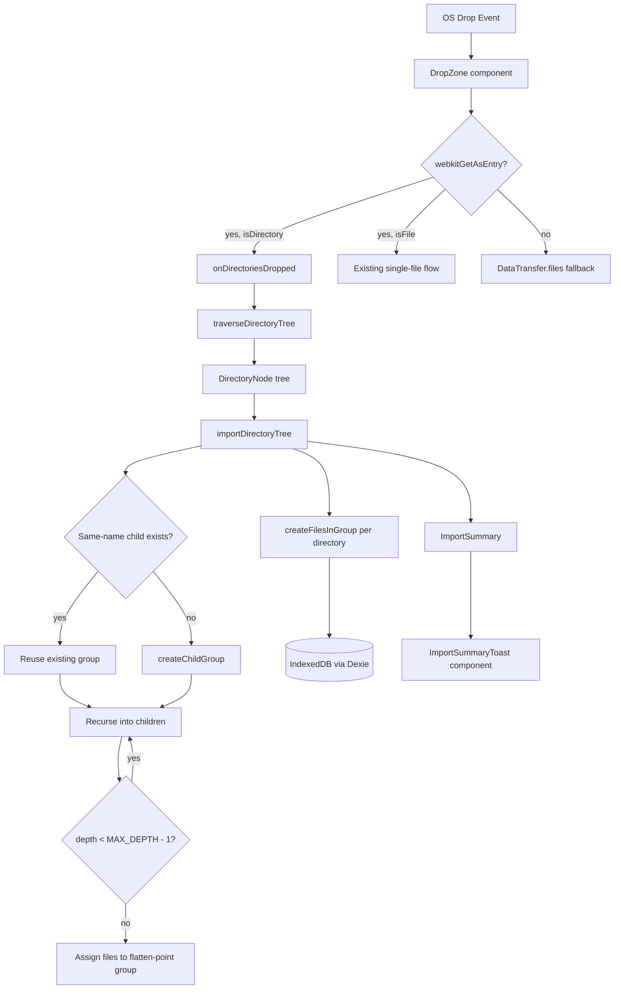

# Design: Directory Drop — Hierarchical Import

> Status: Draft

## Overview

Replaces the flat directory-drop import with a hierarchical import that mirrors a dropped directory's folder structure as nested groups. Raises the system-wide MAX_DEPTH from 3 → 6 and introduces recursive merge semantics (same-name group reuse at every level). Adds an import summary toast for user feedback.

The core change is a new `traverseDirectoryTree` function that returns a `DirectoryNode` tree (rather than a flat `CollectedFile[]`), and a new `importDirectoryTree` orchestrator that walks this tree recursively creating/reusing groups and assigning files. The existing `collectFilesFromDirectory` is superseded.

## Architecture



## Key Decisions

1. **Tree-first traversal**: Separate traversal from DB writes. `traverseDirectoryTree` builds an in-memory tree, then `importDirectoryTree` walks it. This keeps traversal pure/testable and allows the file cap to be enforced globally before any DB work.
2. **MAX_DEPTH as a named constant**: Single constant (`MAX_DEPTH = 6`) exported from `groupTree.ts`, used by all validation paths.
3. **Same-name reuse via `findOrCreateChildGroup`**: Generalisation of the existing `findOrCreateDirectoryGroup` that accepts a `parentId` parameter and queries children of that parent.
4. **Flatten-point**: When a source subdirectory would produce a group at depth ≥ MAX_DEPTH, its files (and all deeper files) are placed in the deepest allowed group (depth MAX_DEPTH − 1).
5. **Toast component**: Lightweight `<ImportSummaryToast>` with auto-dismiss (3s timeout), rendered via a state array in App.

## Components and Interfaces

### New: `src/lib/directoryTraversal.ts`

Replaces the traversal responsibility of `collectFilesFromDirectory` with a tree-returning variant.

```typescript
/** A node in the in-memory directory tree. */
export interface DirectoryNode {
  /** Folder name (untrimmed — trimming happens at group-creation time). */
  name: string
  /** Files directly in this directory (readable, content loaded). */
  files: CollectedFile[]
  /** Subdirectories. */
  children: DirectoryNode[]
}

/** Result of traversal including cap status. */
export interface TraversalResult {
  root: DirectoryNode
  /** Total readable files found (may exceed cap). */
  totalFilesFound: number
  /** Whether the file cap was reached. */
  capReached: boolean
}

/**
 * Recursively traverse a FileSystemDirectoryEntry, building a DirectoryNode tree.
 * - BFS traversal with depth tracking.
 * - Applies readability filter on files.
 * - Enforces global file cap (default 200) across all levels.
 * - Skips files that fail to read.
 * - Traversal depth is unlimited (groups are capped at import time, not traversal time)
 *   but a safety max of 20 levels prevents runaway recursion.
 */
export async function traverseDirectoryTree(
  dirEntry: FileSystemDirectoryEntry,
  options?: { maxFiles?: number; maxTraversalDepth?: number }
): Promise<TraversalResult>
```

### Modified: `src/lib/directoryImport.ts`

Retains `CollectedFile` interface and readability helpers. The `collectFilesFromDirectory` function remains for backward compatibility but is no longer called from App.

### New: `src/lib/importOrchestrator.ts`

Orchestrates the group creation and file persistence from a `DirectoryNode` tree.

```typescript
/** Counts returned after import for toast display. */
export interface ImportSummary {
  groupsCreated: number
  groupsReused: number
  filesImported: number
  filesUpdated: number
  capReached: boolean
}

/**
 * Import a DirectoryNode tree into the database as nested groups.
 * - Creates/reuses groups recursively via same-name matching.
 * - Flattens files beyond MAX_DEPTH into the deepest allowed group.
 * - Respects file cap (files already counted during traversal).
 * - Returns summary counts for toast.
 */
export async function importDirectoryTree(
  tree: DirectoryNode,
  options?: { parentId?: number | null }
): Promise<ImportSummary>
```

### Modified: `src/db/schema.ts`

New function generalising `findOrCreateDirectoryGroup` to any parent level:

```typescript
/**
 * Find an existing child group by exact name match under a given parent, or create one.
 * - Trims name; rejects empty/whitespace-only (returns null).
 * - Caps name at 255 characters after trimming.
 * - Reuses existing child if name matches (case-sensitive, post-trim) under same parentId.
 * - New groups get sortOrder = max(sibling sortOrders) + 1.
 * - Returns { id, created: boolean }.
 */
export async function findOrCreateChildGroup(
  dirName: string,
  parentId: number | null
): Promise<{ id: number; created: boolean } | null>
```

The existing `findOrCreateDirectoryGroup(dirName)` becomes a thin wrapper: `findOrCreateChildGroup(dirName, null)`.

Additionally, `createFilesInGroup` is updated with **upsert semantics**:

```typescript
/**
 * Import files into a group with version-update-on-re-drop:
 * - For each file, check if a file record with the same name (case-sensitive)
 *   already exists in the target group.
 * - If a same-name file exists: add a new version to that file record with
 *   source = 'drop', update currentVersionId and updatedAt.
 * - If no same-name file exists: create a new file record with initial version.
 * - Returns array of all affected file records (created or updated).
 */
export async function createFilesInGroup(
  groupId: number,
  files: Array<{ name: string; content: string }>
): Promise<FileRecord[]>
```

### Modified: `src/db/groupTree.ts`

```typescript
/** System-wide maximum group nesting depth. Root = 0, deepest allowed = MAX_DEPTH - 1. */
export const MAX_DEPTH = 6
```

All references to the hardcoded `3` in `validateReparent`, `createChildGroup`, and UI depth checks are replaced with `MAX_DEPTH`.

### New: `src/components/ImportSummaryToast.tsx`

```typescript
interface ToastData {
  id: string
  groupsCreated: number
  groupsReused: number
  filesImported: number
  capReached: boolean
}

interface Props {
  toasts: ToastData[]
  onDismiss: (id: string) => void
}

/**
 * Renders a stack of auto-dismissing toast notifications.
 * Each toast disappears after 4 seconds or on click.
 * Message format: "Imported {groups} groups, {files} files"
 * If capReached: appends "(cap reached)"
 */
export function ImportSummaryToast({ toasts, onDismiss }: Props): JSX.Element
```

### Modified: `src/App.tsx`

The `onDirectoriesDropped` handler is rewritten to use the new traversal + orchestrator:

```typescript
const onDirectoriesDropped = useCallback(
  async (entries: FileSystemDirectoryEntry[]) => {
    for (const dirEntry of entries) {
      const dirName = dirEntry.name.trim()
      if (!dirName) continue

      const { root, capReached } = await traverseDirectoryTree(dirEntry)
      const summary = await importDirectoryTree(root)

      addToast({
        groupsCreated: summary.groupsCreated,
        groupsReused: summary.groupsReused,
        filesImported: summary.filesImported,
        capReached: summary.capReached || capReached,
      })

      // Render last imported file in pane
      if (summary.filesImported > 0) {
        // Load last created file for display
        ...
      }
      bumpLibrary()
    }
  },
  [applyRawDocument, bumpLibrary, addToast]
)
```

## Data Models

No schema migration required. Uses existing tables:

| Table | Fields | Notes |
|-------|--------|-------|
| `groups` | `id`, `name`, `sortOrder`, `parentId` | Nested groups via `parentId` chain |
| `files` | `id`, `name`, `groupId`, `groupPlacement`, `currentVersionId`, `updatedAt` | `groupPlacement = 'auto'` |
| `versions` | `id`, `fileId`, `content`, `createdAt`, `source` | `source = 'drop'` |

## Algorithms

### Hierarchical Traversal (`traverseDirectoryTree`)

```
traverseDirectoryTree(dirEntry, { maxFiles = 200, maxTraversalDepth = 20 }):
  fileCount = 0
  capReached = false

  function buildNode(entry, depth):
    node = { name: entry.name, files: [], children: [] }
    entries = await readAllEntries(entry.createReader())

    for child in entries:
      if child.isFile:
        if fileCount >= maxFiles:
          capReached = true
          continue
        if isReadableEntry(child):
          try:
            file = await fileEntryToFile(child)
            if !isReadableFile(file): continue
            basename = file.name.trim()
            if basename == '': continue
            content = await file.text()
            node.files.push({ name: basename, content })
            fileCount++
          catch: continue
      else if child.isDirectory && depth + 1 < maxTraversalDepth:
        childNode = await buildNode(child, depth + 1)
        node.children.push(childNode)

    return node

  root = await buildNode(dirEntry, 0)
  return { root, totalFilesFound: fileCount, capReached }
```

### Recursive Group Creation (`importDirectoryTree`)

```
importDirectoryTree(tree, { parentId = null }):
  summary = { groupsCreated: 0, groupsReused: 0, filesImported: 0, capReached: false }

  function importNode(node, parentId, currentDepth):
    // Create or reuse group for this directory
    result = await findOrCreateChildGroup(node.name, parentId)
    if result == null: return  // whitespace name
    
    if result.created:
      summary.groupsCreated++
    else:
      summary.groupsReused++

    groupId = result.id

    // Import files at this level into this group
    if node.files.length > 0:
      await createFilesInGroup(groupId, node.files)
      summary.filesImported += node.files.length

    // Recurse into children
    for child in node.children:
      if currentDepth + 1 >= MAX_DEPTH:
        // Flatten: assign child's files (and all deeper files) to this group
        flatFiles = collectAllFilesDeep(child)
        if flatFiles.length > 0:
          await createFilesInGroup(groupId, flatFiles)
          summary.filesImported += flatFiles.length
      else:
        await importNode(child, groupId, currentDepth + 1)

  await importNode(tree, parentId, parentId === null ? 0 : computeDepth(parentId) + 1)
  return summary

function collectAllFilesDeep(node):
  files = [...node.files]
  for child in node.children:
    files.push(...collectAllFilesDeep(child))
  return files
```

### Same-Name Reuse (`findOrCreateChildGroup`)

```
findOrCreateChildGroup(dirName, parentId):
  trimmed = dirName.trim()
  if !trimmed: return null
  capped = trimmed.slice(0, 255)

  existing = query groups WHERE name = capped AND parentId = parentId
  if existing:
    return { id: existing.id, created: false }

  siblings = query groups WHERE parentId = parentId
  maxOrder = max(siblings.sortOrder) or -1
  newId = insert group { name: capped, sortOrder: maxOrder + 1, parentId }
  return { id: newId, created: true }
```

### File Upsert (`createFilesInGroup`)

```
createFilesInGroup(groupId, files):
  results = []
  for { name, content } in files:
    existing = query files WHERE name = name AND groupId = groupId (first match)
    if existing:
      // Add new version to existing file
      versionId = insert version { fileId: existing.id, content, createdAt: now, source: 'drop' }
      update file existing.id { currentVersionId: versionId, updatedAt: now }
      results.push(updated file)
    else:
      // Create new file + initial version
      fileId = insert file { name, currentVersionId: 0, updatedAt: now, groupId, groupPlacement: 'auto' }
      versionId = insert version { fileId, content, createdAt: now, source: 'drop' }
      update file fileId { currentVersionId: versionId }
      results.push(new file)
  return results
```

### MAX_DEPTH Change — Affected Code Paths

| Location | Current | New |
|----------|---------|-----|
| `src/db/groupTree.ts` → `validateReparent` | Hardcoded `3` | `MAX_DEPTH` constant (6) |
| `src/db/schema.ts` → `createChildGroup` | `parentDepth >= 3` | `parentDepth >= MAX_DEPTH - 1` |
| `src/components/GroupNode.tsx` | `depth >= 3` UI check | `depth >= MAX_DEPTH - 1` |
| `src/db/__tests__/depthInvariant.property.test.ts` | Asserts max 3 | Asserts max `MAX_DEPTH` |

## Toast Component Design

```
┌─────────────────────────────────────────┐
│  ✓ Imported 3 groups, 12 files          │
└─────────────────────────────────────────┘

┌─────────────────────────────────────────┐
│  ✓ Imported 5 groups, 200 files         │
│    (cap reached)                        │
└─────────────────────────────────────────┘

┌─────────────────────────────────────────┐
│  ✓ Imported 3 groups, 8 files           │
│    (5 updated)                          │
└─────────────────────────────────────────┘
```

- Positioned fixed, bottom-right of viewport
- Auto-dismiss after 4 seconds (CSS transition fade-out)
- Click to dismiss early
- Stacks if multiple imports finish close together
- No user action required — non-blocking

## Error Handling

| Scenario | Handling |
|----------|----------|
| Directory name empty/whitespace after trim | No groups created, no files imported, no toast |
| Individual file read failure | Skip file, continue. Counts reflect successful imports only |
| All files in directory fail to read | Groups still created (empty). Toast shows "0 files" |
| Subdirectory at depth ≥ MAX_DEPTH | Files flattened into deepest allowed group (depth MAX_DEPTH − 1) |
| File cap (200) reached mid-traversal | Stop collecting files; continue traversing for group creation. Toast indicates cap |
| IndexedDB unavailable or write failure | Render last readable file in-memory; show persist warning in header |
| `webkitGetAsEntry()` unavailable | Fall back to DataTransfer.files; directories silently skipped |

## Correctness Properties

*A property is a characteristic or behavior that should hold true across all valid executions of a system — essentially, a formal statement about what the system should do. Properties serve as the bridge between human-readable specifications and machine-verifiable correctness guarantees.*

### Property 1: Depth invariant under hierarchical import

*For any* directory tree of arbitrary depth, after hierarchical import, no group in the database SHALL have a computed depth exceeding MAX_DEPTH − 1 (i.e. depth 5). All groups created by the import satisfy `computeDepth(group) ≤ 5`.

**Validates: Requirements 1.1, 1.5, 2.2, 2.3**

### Property 2: Structure mirroring

*For any* directory tree where every subdirectory is within the depth limit (source tree depth ≤ MAX_DEPTH counting root as level 1), the resulting group hierarchy SHALL have a one-to-one correspondence between source subdirectories and groups: each subdirectory becomes a child group of its parent directory's group, with group name equal to the subdirectory's folder name (trimmed, capped at 255 chars).

**Validates: Requirements 2.1, 2.5, 7.1, 7.2, 7.3**

### Property 3: File assignment correctness

*For any* directory tree and any readable file at directory level L (where L ≤ MAX_DEPTH − 1), the file record SHALL have `groupId` pointing to the group at depth L, `groupPlacement` equal to `'auto'`, and `name` equal to the file's basename.

**Validates: Requirements 2.4, 8.5, 8.6**

### Property 4: Flatten-point assignment

*For any* directory tree with files at source depth D > MAX_DEPTH − 1, those files SHALL be assigned to the group at depth MAX_DEPTH − 1 (the deepest allowed ancestor group). No group is created for directories beyond the depth limit.

**Validates: Requirements 2.3, 5.3**

### Property 5: Same-name reuse idempotence

*For any* directory tree imported twice in succession, the second import SHALL create zero new groups (all are reused via same-name matching at every level), SHALL NOT modify existing groups' `sortOrder` or other properties, and SHALL NOT delete any pre-existing file records. For files with the same name already in the target group, the second import SHALL add a new version to the existing file record (version count increases by 1) rather than creating a duplicate file record. For files with no same-name match, new file records are created.

**Validates: Requirements 3.1, 3.2, 3.3, 4.1, 4.3, 4.4, 4.5**

### Property 6: Import summary accuracy

*For any* directory tree import, the returned `ImportSummary.groupsCreated + ImportSummary.groupsReused` SHALL equal the total number of `findOrCreateChildGroup` calls that returned non-null, and `ImportSummary.filesImported` SHALL equal the count of file records created in the database during that import. `capReached` SHALL be true if and only if the traversal encountered more readable files than the file cap (200).

**Validates: Requirements 6.2, 6.4**

### Property 7: File cap enforcement

*For any* directory tree containing N > 200 readable files, the number of file records created SHALL be exactly 200. Groups corresponding to all traversed directories (up to the point traversal completes) SHALL still be created regardless of the file cap.

**Validates: Requirements 5.1, 5.2, 5.3**

### Property 8: Whitespace directory name rejection

*For any* string composed entirely of whitespace characters (including empty string) as the root directory name, the import SHALL create zero groups and zero file records.

**Validates: Requirements 9.3**

### Property 9: File version update on re-drop

*For any* file F with name N in group G, when a new file with the same name N is imported into group G, the system SHALL NOT create a new file record. Instead, it SHALL add a new version record to the existing file F with `source = 'drop'`, update F's `currentVersionId` to the new version, and update F's `updatedAt`. The total file record count for name N in group G SHALL remain 1. The version count for F SHALL increase by 1.

**Validates: Requirements 4.3, 4.4**

## Testing Strategy

**Property-based testing** (fast-check, ≥ 100 iterations per property):

| Property | Target Layer | Test File |
|----------|-------------|-----------|
| 1: Depth invariant | `importDirectoryTree` + DB | `src/db/__tests__/hierarchicalImport.property.test.ts` |
| 2: Structure mirroring | `importDirectoryTree` + DB | `src/db/__tests__/hierarchicalImport.property.test.ts` |
| 3: File assignment | `importDirectoryTree` + DB | `src/db/__tests__/hierarchicalImport.property.test.ts` |
| 4: Flatten-point | `importDirectoryTree` + DB | `src/db/__tests__/hierarchicalImport.property.test.ts` |
| 5: Same-name reuse | `importDirectoryTree` + DB | `src/db/__tests__/hierarchicalImport.property.test.ts` |
| 6: Import summary | `importDirectoryTree` + DB | `src/db/__tests__/hierarchicalImport.property.test.ts` |
| 7: File cap | `traverseDirectoryTree` | `src/lib/__tests__/directoryTraversal.property.test.ts` |
| 8: Whitespace rejection | `findOrCreateChildGroup` | `src/db/__tests__/hierarchicalImport.property.test.ts` |
| 9: File version update | `createFilesInGroup` + DB | `src/db/__tests__/hierarchicalImport.property.test.ts` |

**Unit tests** (example-based):
- Toast auto-dismiss timing and stacking
- IndexedDB failure renders last file in-memory
- Empty directory creates group hierarchy with no files
- Single file directory (no subdirs) produces same result as old flat import
- MAX_DEPTH constant is used consistently (import test at boundary)

**Property test configuration:**
- Library: `fast-check` (already in devDependencies)
- Minimum 100 iterations per property
- Tag format: `Feature: directory-drop-hierarchical, Property N: <title>`
- DB tests use `fake-indexeddb` for real Dexie transactions
- Traversal tests use mock `FileSystemDirectoryEntry` objects (same pattern as existing tests)
