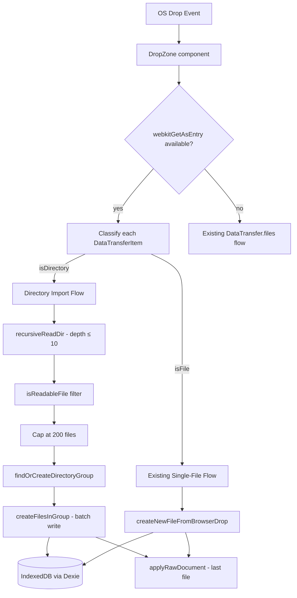

# Design: Directory Drop Import

> Status: Accepted
> Accepted by: Michael Herrmann
> Accepted on: 2025-07-14

## Overview

Extends the existing `DropZone` component to detect and handle OS directory drops. When a directory is dropped, the system uses the File System Access API (`webkitGetAsEntry`) to recursively traverse the directory tree, extract all readable files, create (or reuse) a root-level group named after the directory, and import all files into that group as a flat list. The existing single-file drop flow remains unchanged for non-directory items.

The design reuses the existing `isReadableFile` filter, `db.groups`/`db.files`/`db.versions` Dexie tables, and `applyRawDocument` rendering pipeline. The new logic lives primarily in a new pure module (`src/lib/directoryImport.ts`) for the traversal/collection logic, with a thin integration layer in `DropZone` and `App`.

## Architecture



## Components and Interfaces

### `src/lib/directoryImport.ts` (new module)

Pure traversal and collection logic, separated from DB and UI concerns.

```typescript
/** A file collected from directory traversal. */
export interface CollectedFile {
  /** Basename of the file (last path component). */
  name: string
  /** UTF-8 text content. */
  content: string
}

/**
 * Recursively traverse a FileSystemDirectoryEntry, collecting readable files.
 * - Respects depth limit (default 10).
 * - Applies readability filter (same extensions/MIME types as DropZone).
 * - Caps output at maxFiles (default 200).
 * - Skips files that fail to read (permission/encoding errors).
 * - Skips files whose basename is empty or whitespace-only after trimming.
 */
export async function collectFilesFromDirectory(
  dirEntry: FileSystemDirectoryEntry,
  options?: { maxDepth?: number; maxFiles?: number }
): Promise<CollectedFile[]>

/**
 * Determine if a FileSystemEntry is readable based on name/extension.
 * Reuses the same logic as the existing DropZone filter.
 */
export function isReadableEntry(entry: FileSystemFileEntry): boolean
```

### `src/db/schema.ts` (extended)

New function for directory-based group creation with reuse semantics:

```typescript
/**
 * Find an existing root-level group by exact name match, or create one.
 * - Trims name; rejects empty/whitespace-only (returns null).
 * - Caps name at 255 characters after trimming.
 * - Reuses existing root group if name matches (case-sensitive, post-trim).
 * - New groups get sortOrder = max(root sortOrders) + 1, parentId = null.
 */
export async function findOrCreateDirectoryGroup(
  dirName: string
): Promise<number | null>

/**
 * Batch-create file records with versions for a directory import.
 * Each file gets: name = basename, groupPlacement = 'auto',
 * one version with source = 'drop'.
 * Returns the list of created FileRecords.
 */
export async function createFilesInGroup(
  groupId: number,
  files: Array<{ name: string; content: string }>
): Promise<FileRecord[]>
```

### `src/components/DropZone.tsx` (modified)

The `onDrop` handler gains a new code path:

```typescript
type Props = {
  onFiles: (files: File[]) => void
  /** Called when one or more directories are dropped. */
  onDirectories?: (entries: FileSystemDirectoryEntry[]) => void
  children: ReactNode
  className?: string
}
```

When `webkitGetAsEntry()` is available, each `DataTransferItem` is inspected:
- If `entry.isDirectory` → collect into directories list.
- If `entry.isFile` → collect into files list (existing flow).
- Mixed drops: both callbacks fire independently.

Fallback: if `webkitGetAsEntry` is unavailable, all items go through the existing `DataTransfer.files` path (directories that can't be read as files are silently skipped).

### `src/App.tsx` (modified)

New handler wired to `DropZone.onDirectories`:

```typescript
const onDirectoriesDropped = useCallback(
  async (entries: FileSystemDirectoryEntry[]) => {
    for (const dirEntry of entries) {
      const dirName = dirEntry.name
      const groupId = await findOrCreateDirectoryGroup(dirName)
      if (groupId == null) continue // empty/whitespace name

      const collected = await collectFilesFromDirectory(dirEntry)
      if (collected.length === 0) {
        bumpLibrary()
        continue
      }

      try {
        const created = await createFilesInGroup(groupId, collected)
        const last = created[created.length - 1]!
        const ver = await loadFileCurrent(last)
        if (ver) {
          applyRawDocument(ver.content, last.name, last.id!, ver.id!, 'v1')
        }
      } catch (e) {
        // DB failure: render last collected file in memory
        const last = collected[collected.length - 1]!
        applyRawDocument(last.content, last.name, null, null, null)
        setPersistError(
          e instanceof Error ? e.message : 'Could not save to browser storage.'
        )
      }
      bumpLibrary()
    }
  },
  [applyRawDocument, bumpLibrary]
)
```

## Data Models

No schema migration needed. The feature uses existing tables and fields:

| Table | Fields Used | Notes |
|-------|------------|-------|
| `groups` | `id`, `name`, `sortOrder`, `parentId` | New groups created with `parentId = null` |
| `files` | `id`, `name`, `groupId`, `groupPlacement`, `currentVersionId`, `updatedAt` | `groupPlacement = 'auto'` for imported files |
| `versions` | `id`, `fileId`, `content`, `createdAt`, `source` | `source = 'drop'` for all directory imports |

### Group Reuse Logic

```
findOrCreateDirectoryGroup(dirName):
  trimmed = dirName.trim()
  if trimmed is empty → return null
  capped = trimmed.slice(0, 255)
  existing = query groups WHERE name = capped AND parentId = null
  if existing → return existing.id (leave sortOrder unchanged)
  maxOrder = max(sortOrder) among groups WHERE parentId = null
  create group { name: capped, sortOrder: maxOrder + 1, parentId: null }
  return new group id
```

### Directory Traversal Algorithm

```
collectFilesFromDirectory(dirEntry, { maxDepth = 10, maxFiles = 200 }):
  result = []
  queue = [(dirEntry, depth: 0)]

  while queue is not empty AND result.length < maxFiles:
    (entry, depth) = queue.shift()
    readers = entry.createReader()
    entries = await readAllEntries(reader)

    for each child in entries:
      if result.length >= maxFiles → break
      if child.isFile:
        if isReadableEntry(child):
          try:
            file = await fileEntryToFile(child)
            basename = file.name.trim()
            if basename is empty → skip
            content = await file.text()
            result.push({ name: basename, content })
          catch → skip (permission/encoding error)
      else if child.isDirectory AND depth + 1 < maxDepth:
        queue.push((child, depth + 1))

  return result
```

Note: `DirectoryReader.readEntries()` may return partial results; must call repeatedly until empty array is returned.

## Correctness Properties

*A property is a characteristic or behavior that should hold true across all valid executions of a system — essentially, a formal statement about what the system should do. Properties serve as the bridge between human-readable specifications and machine-verifiable correctness guarantees.*

### Property 1: Flat import invariant

*For any* directory drop operation on any directory tree structure, the import SHALL create at most one new root-level group (parentId = null), and all imported file records SHALL share the same `groupId` pointing to that single group.

**Validates: Requirements 2.3, 7.1, 7.2**

### Property 2: Group name derivation

*For any* directory name string, the resulting group name SHALL equal the input trimmed of leading/trailing whitespace and truncated to 255 characters. The group's `parentId` SHALL be null.

**Validates: Requirements 2.1**

### Property 3: Group reuse idempotence

*For any* directory name that matches an existing root-level group's name (case-sensitive, post-trim), the directory import SHALL return the existing group's ID without creating a new group, and the existing group's `sortOrder` SHALL remain unchanged.

**Validates: Requirements 2.2**

### Property 4: Group sort order assignment

*For any* set of existing root-level groups, a newly created directory import group SHALL have `sortOrder` equal to `max(existing root group sortOrders) + 1`, or 0 if no root groups exist.

**Validates: Requirements 2.4**

### Property 5: Whitespace directory names rejected

*For any* string composed entirely of whitespace characters (including empty string), the directory import SHALL not create a group and SHALL not create any file records.

**Validates: Requirements 2.5**

### Property 6: File record shape

*For any* readable file imported from a directory, the created file record SHALL have: `name` equal to the file's basename (last path component), `groupPlacement` equal to `'auto'`, and exactly one associated version record with `source` equal to `'drop'` and `content` equal to the file's UTF-8 text. Duplicate basenames within the same import SHALL each produce their own separate file record.

**Validates: Requirements 3.4, 4.1, 4.2, 4.3**

### Property 7: Readability filter

*For any* file entry encountered during traversal, it SHALL be imported if and only if its filename ends with `.md`, `.markdown`, or `.txt`, or its MIME type is `text/markdown` or `text/plain`. All other entries SHALL be skipped.

**Validates: Requirements 3.2, 3.3**

### Property 8: Depth-limited traversal

*For any* directory tree with entries at varying depths, the traversal SHALL visit all entries at depth ≤ 10 (relative to the dropped directory) and SHALL NOT visit entries beyond depth 10.

**Validates: Requirements 3.1**

### Property 9: File count cap

*For any* directory containing N readable files where N > 200, the number of imported file records SHALL be exactly 200.

**Validates: Requirements 3.6**

### Property 10: Error resilience

*For any* directory where K out of N readable files fail to read (permission or encoding errors), the system SHALL successfully import exactly N − K files and SHALL not abort the remaining imports.

**Validates: Requirements 6.1, 6.2**

### Property 11: Mixed drop dispatch

*For any* drop event containing a mix of M individual files and D directories, the system SHALL process all M files through the single-file import flow and all D directories through the directory import flow independently.

**Validates: Requirements 1.2**

## Error Handling

| Scenario | Handling |
|----------|----------|
| `webkitGetAsEntry()` unavailable | Fall back to `DataTransfer.files`; directories appear as unreadable items and are silently skipped |
| Individual file read failure (permission/encoding) | Skip that file, continue importing remaining files |
| All files in directory fail to read | Group is still created (empty); main pane unchanged |
| Directory name empty/whitespace after trim | No group created, no files imported, no error shown |
| Directory exceeds 200 readable files | First 200 imported, rest discarded silently |
| Traversal exceeds 10 levels deep | Subdirectories beyond depth 10 are not entered |
| IndexedDB unavailable or write failure | Last readable file's content rendered in-memory; non-blocking warning displayed in header |
| `DirectoryReader.readEntries()` returns partial batch | Call repeatedly until empty array returned (per spec) |

## Testing Strategy

**Property-based testing** (fast-check, ≥ 100 iterations per property):
- The core traversal and collection logic (`collectFilesFromDirectory`) operates on mockable `FileSystemDirectoryEntry` objects. Properties 5–10 target this pure-ish layer.
- The group creation/reuse logic (`findOrCreateDirectoryGroup`) runs against fake-indexeddb. Properties 2–5 target this layer.
- Property 1 (flat invariant) and Property 11 (mixed dispatch) span the integration of both layers.

**Unit tests** (example-based):
- `webkitGetAsEntry` fallback behavior (Req 1.4)
- Internal drag guard still works (Req 1.3)
- Empty directory creates group but no files (Req 3.5)
- Last file is rendered after import (Req 5.1)
- No-file import leaves pane unchanged (Req 5.2)
- Library refresh triggered (Req 5.3)
- DB failure shows warning and renders in-memory (Req 6.3)

**Property test configuration:**
- Library: `fast-check` (already in devDependencies)
- Minimum 100 iterations per property
- Tag format: `Feature: directory-drop-import, Property N: <title>`
- Each correctness property maps to one property-based test

**Test file locations:**
- `src/lib/__tests__/directoryImport.property.test.ts` — Properties 5–10 (traversal/collection logic)
- `src/db/__tests__/directoryGroup.property.test.ts` — Properties 2–4 (group creation/reuse)
- `src/db/__tests__/directoryImportIntegration.property.test.ts` — Properties 1, 6, 11 (end-to-end with mocked FS API)
