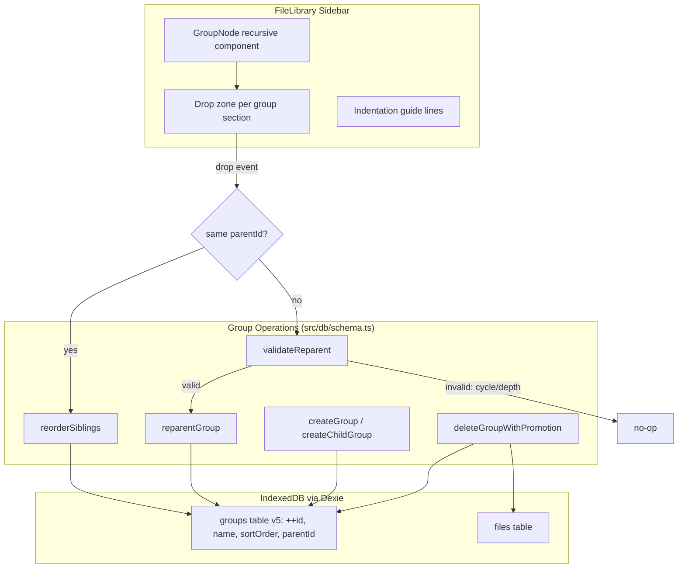

# Nested Groups — Design

> Status: Accepted
> Accepted by: Michael Herrmann
> Accepted on: 2025-07-14

## Overview

Extends the flat group model in `docs/file-management/` to support hierarchical nesting up to 4 levels deep (depth 0, 1, 2, 3). Groups gain a nullable `parentId` foreign key, enabling tree structures. The FileLibrary sidebar renders nested groups with indentation and guide lines. Drag-and-drop is extended to support reparenting groups (moving a group into another group or back to root) alongside the existing reorder behavior.

Key design goals:
- Tree integrity: no cycles, max depth enforced, subtree travels with moved group
- Minimal schema change: single `parentId` column addition via Dexie v5 migration
- Backward-compatible: existing flat groups become root groups (parentId = null)
- Atomic mutations: all multi-step operations wrapped in IndexedDB transactions

## Architecture



## Components and Interfaces

### Extended GroupRecord

```typescript
export interface GroupRecord {
  id?: number
  name: string
  sortOrder: number
  parentId: number | null  // NEW: null = root group
}
```

### Group Tree Utilities (`src/db/groupTree.ts`)

```typescript
/** Compute depth of a group by traversing parentId chain. */
export function computeDepth(
  groupId: number,
  groupsById: Map<number, GroupRecord>
): number

/** Get all ancestor IDs from group up to root (exclusive of groupId itself). */
export function getAncestorIds(
  groupId: number,
  groupsById: Map<number, GroupRecord>
): number[]

/** Get all descendant IDs (transitive children). */
export function getDescendantIds(
  groupId: number,
  childrenByParent: Map<number | null, GroupRecord[]>
): number[]

/** Validate a reparent operation. Returns null if valid, error string if invalid. */
export function validateReparent(
  groupId: number,
  targetParentId: number | null,
  groupsById: Map<number, GroupRecord>,
  childrenByParent: Map<number | null, GroupRecord[]>
): string | null

/** Build lookup maps from a flat group array. */
export function buildGroupMaps(groups: GroupRecord[]): {
  byId: Map<number, GroupRecord>
  childrenByParent: Map<number | null, GroupRecord[]>
}
```

### Database Operations (`src/db/schema.ts` additions)

```typescript
/** Reparent a group to a new parent (or root). Atomic transaction. */
export async function reparentGroup(
  groupId: number,
  newParentId: number | null
): Promise<void>

/** Reorder siblings sharing the same parentId. Atomic transaction. */
export async function reorderSiblings(
  parentId: number | null,
  orderedIds: number[]
): Promise<void>

/** Create a child group under a specific parent. */
export async function createChildGroup(
  name: string,
  parentId: number | null
): Promise<number>

/** Delete a group, promoting children and files to the deleted group's parent. */
export async function deleteGroupWithPromotion(
  groupId: number
): Promise<{ promotedGroupIds: number[]; promotedFileIds: number[] }>
```

### FileLibrary Component Changes

The current flat rendering loop becomes recursive:

```typescript
/** Renders a group and its children recursively. */
function GroupNode({
  group,
  depth,
  childrenByParent,
  filesByGroup,
  // ... existing props
}: GroupNodeProps): JSX.Element
```

Key changes:
- `GroupNode` renders its own section, then recursively renders child groups
- Each level adds 16px left padding relative to parent
- Vertical guide lines rendered via CSS `::before` pseudo-elements on nested sections
- Collapse state tracked per group (existing `collapsedSections` set, keyed by group ID)
- "Create child group" context action shown on groups at depth < 3

### Drag-and-Drop Protocol Updates

Existing MIME types remain unchanged. The drop handler gains reparent detection:

```typescript
// In group section drop handler:
function handleGroupDrop(e: DragEvent, targetSectionGroupId: number | null) {
  const sourceGroupId = Number(e.dataTransfer.getData(DND_GROUP_MIME))
  
  if (sourceGroupId === targetSectionGroupId) {
    // Reorder within same parent — existing behavior
    return handleReorder(sourceGroupId, targetSectionGroupId)
  }
  
  // Different parent → reparent operation
  const error = validateReparent(sourceGroupId, targetSectionGroupId, ...)
  if (error) return // no-op
  
  await reparentGroup(sourceGroupId, targetSectionGroupId)
}
```

**Reorder vs Reparent detection**: Compare the dragged group's current `parentId` with the target section's `parentId`. Same = reorder; different = reparent.

## Data Models

### Dexie Schema v5

```typescript
this.version(5)
  .stores({
    files: '++id, name, updatedAt, currentVersionId, groupId, groupPlacement',
    versions: '++id, fileId, createdAt',
    groups: '++id, name, sortOrder, parentId',  // parentId indexed
  })
  .upgrade(async (tx) => {
    const t = tx.table('groups')
    await t.toCollection().modify((row: Record<string, unknown>) => {
      if (row.parentId === undefined) {
        row.parentId = null
      }
    })
  })
```

### In-Memory Tree Representation

Operations build lookup maps from the flat `groups` array:

```typescript
// Map<groupId, GroupRecord> for O(1) lookup
const byId = new Map<number, GroupRecord>()

// Map<parentId | null, GroupRecord[]> for children lookup
const childrenByParent = new Map<number | null, GroupRecord[]>()
```

These are rebuilt on each library refresh (group count is small, < 100 expected).

### Key Algorithms

#### Circular Reference Prevention (ancestor traversal)

```
validateReparent(groupId, targetParentId):
  if targetParentId === null → valid (moving to root)
  if targetParentId === groupId → invalid (self-reference)
  
  walk = targetParentId
  while walk !== null:
    if walk === groupId → invalid (target is descendant of group)
    walk = groupsById.get(walk).parentId
  
  // Depth check: compute depth of target + max subtree depth of group
  targetDepth = computeDepth(targetParentId, groupsById)
  subtreeMaxDepth = maxDescendantDepth(groupId, childrenByParent)
  if (targetDepth + 1 + subtreeMaxDepth) > 3 → invalid (exceeds max depth)
  
  return valid
```

#### Deletion with Promotion

```
deleteGroupWithPromotion(groupId):
  transaction:
    group = groups.get(groupId)
    parentId = group.parentId  // may be null
    
    // Promote direct child groups to deleted group's parent
    directChildren = childrenByParent.get(groupId)
    for child in directChildren:
      child.parentId = parentId
      // Assign sortOrder to place them at deleted group's former position
    
    // Move files to parent group (or ungrouped)
    files.filter(f => f.groupId === groupId).modify({ groupId: parentId })
    
    // Delete the group
    groups.delete(groupId)
    
    // Recompute contiguous sortOrder for affected parent's children
    reorderSiblings(parentId, ...)
```

#### Reorder Within Same Level

```
reorderSiblings(parentId, orderedIds):
  transaction:
    for i in 0..orderedIds.length:
      groups.update(orderedIds[i], { sortOrder: i })
```

## Correctness Properties

*A property is a characteristic or behavior that should hold true across all valid executions of a system — essentially, a formal statement about what the system should do. Properties serve as the bridge between human-readable specifications and machine-verifiable correctness guarantees.*

### Property 1: Depth invariant

*For any* sequence of group creation and reparent operations, no group in the resulting tree SHALL have a depth greater than 3 (where depth is the number of ancestors between the group and root level).

**Validates: Requirements 1.4, 3.5**

### Property 2: Circular reference prevention

*For any* group tree and any attempted reparent of group G to target T, if T is G itself or any transitive descendant of G, the operation SHALL be rejected and the tree SHALL remain unchanged.

**Validates: Requirements 1.6, 3.3, 3.4, 4.3, 6.1, 6.2, 6.3**

### Property 3: Subtree integrity on reparent

*For any* valid reparent of group G to a new parent, only G's `parentId` field SHALL change; all descendant groups' `parentId` values and all files' `groupId` values within the subtree SHALL remain identical to their pre-operation values.

**Validates: Requirements 4.1, 4.2**

### Property 4: Contiguous sibling sortOrder

*For any* parent (including null for root level), after any mutation (create, reparent, reorder, delete), the `sortOrder` values among siblings sharing that parent SHALL form a contiguous sequence starting at 0 with no gaps or duplicates.

**Validates: Requirements 1.5, 5.1**

### Property 5: Reorder vs reparent classification

*For any* group drop operation, if the dragged group's current `parentId` equals the target section's `parentId`, the system SHALL treat it as a reorder; otherwise it SHALL treat it as a reparent.

**Validates: Requirements 5.2**

### Property 6: Whitespace group name rejection

*For any* string composed entirely of whitespace characters (including empty string), attempting to create a group with that name SHALL be rejected and the group list SHALL remain unchanged.

**Validates: Requirements 7.4**

### Property 7: Deletion promotes children and files

*For any* group G with parent P (possibly null), deleting G SHALL result in all of G's direct child groups having `parentId` equal to P, and all files with `groupId` equal to G's id having `groupId` equal to P.

**Validates: Requirements 8.1, 8.2**

### Property 8: Migration preserves existing data

*For any* set of existing group records (with fields id, name, sortOrder), after the v5 migration runs, each group SHALL have `parentId` set to null and its `id`, `name`, and `sortOrder` values SHALL be identical to their pre-migration values.

**Validates: Requirements 9.2, 9.3**

## Error Handling

| Scenario | Handling |
|----------|----------|
| Reparent to self or descendant | `validateReparent` returns error string; UI ignores drop silently |
| Reparent exceeds max depth | `validateReparent` returns error string; UI ignores drop silently |
| Group with invalid parentId (orphan) | Treated as root group (parentId effectively null for rendering) |
| Empty/whitespace group name | `createGroup`/`createChildGroup` throws; caller catches and no-ops |
| IndexedDB transaction failure | Error propagates to caller; no partial state written (Dexie rollback) |
| Concurrent modification | Dexie transaction isolation handles; last writer wins within transaction |

## Testing Strategy

### Property-Based Tests (fast-check)

Library: [fast-check](https://github.com/dubzzz/fast-check) — mature PBT library for TypeScript.

Each correctness property maps to a single property-based test with minimum 100 iterations. Tests target the pure logic layer (`groupTree.ts` utilities and DB operation functions with mocked Dexie).

**Tag format**: `Feature: nested-groups, Property {N}: {title}`

Generators needed:
- `arbGroupTree(maxGroups, maxDepth)` — generates valid tree structures as `GroupRecord[]`
- `arbReparentAttempt(tree)` — generates (groupId, targetParentId) pairs including invalid ones
- `arbWhitespaceString()` — generates strings of only whitespace characters
- `arbReorderOp(siblings)` — generates permutations of sibling ID arrays

### Unit Tests (example-based)

- UI rendering: indentation calculation, guide line presence, collapse behavior
- Drop classification: specific scenarios for reorder vs reparent
- Edge cases: orphan parentId, empty table migration, self-drop, cancel deletion
- Confirmation dialog: correct child/file counts displayed

### Integration Tests

- Full Dexie transaction atomicity (reparent, reorder, delete with promotion)
- Migration from v4 → v5 with real IndexedDB (via fake-indexeddb)
- FileLibrary component rendering with nested group data
