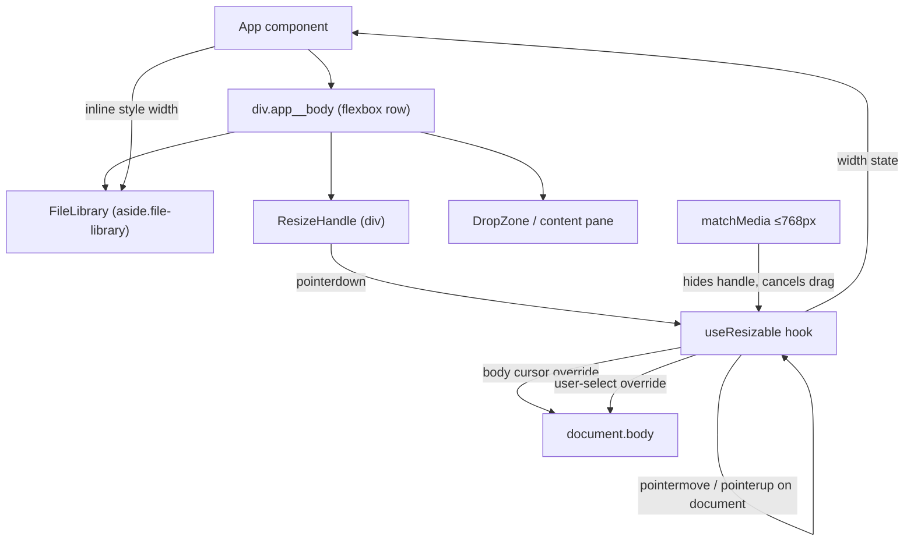

# Resizable Sidebar — Design

> Status: Draft

## Overview

Add a draggable resize handle between the FileLibrary sidebar and the main content pane. The handle lets users adjust the sidebar width via pointer drag or keyboard arrows, with clamping to sensible bounds. On narrow viewports (≤ 768px) the handle is removed and the existing stacked layout takes over.

The implementation adds a single new component (`ResizeHandle`) rendered between the sidebar and content pane in App.tsx, and a custom hook (`useResizable`) that encapsulates the resize state machine (idle → dragging → idle). No changes to FileLibrary internals; only its container width is driven externally.

## Architecture



### Integration with existing layout

The current `.app__body` is `display: flex`. The sidebar has `width: 17rem` set in CSS. The design replaces this fixed width with an inline `style={{ width: px }}` driven by the hook, while CSS provides the default via a custom property fallback.

## Components and Interfaces

### `useResizable` hook

```typescript
interface UseResizableOptions {
  defaultWidth: number       // 272 (17rem * 16)
  minWidth: number           // 120
  maxWidthRatio: number      // 0.5
}

interface UseResizableReturn {
  width: number                          // current sidebar width in px
  isDragging: boolean                    // true while drag active
  handleProps: {
    onPointerDown: (e: PointerEvent) => void
    onKeyDown: (e: KeyboardEvent) => void
    tabIndex: number
    role: string
    'aria-orientation': string
    'aria-valuemin': number
    'aria-valuemax': number
    'aria-valuenow': number
    'aria-label': string
  }
}

function useResizable(options: UseResizableOptions): UseResizableReturn
```

**State machine:**
- `idle`: no pointer capture, no document listeners
- `dragging`: pointer captured, document-level `pointermove` + `pointerup` + `pointercancel` listeners attached, body cursor set to `col-resize`, body `user-select` set to `none`

**Width calculation (pure):**

```typescript
function clampWidth(raw: number, min: number, max: number): number {
  return Math.min(max, Math.max(min, raw))
}

function computeWidth(
  pointerX: number,
  dragStartOffset: number,
  minWidth: number,
  maxWidth: number
): number {
  return clampWidth(pointerX - dragStartOffset, minWidth, maxWidth)
}
```

`dragStartOffset` = `pointerX_at_start - sidebar_width_at_start`, preserving the pointer's position within the handle.

### `ResizeHandle` component

```typescript
interface ResizeHandleProps {
  isDragging: boolean
  handleProps: UseResizableReturn['handleProps']
}

function ResizeHandle({ isDragging, handleProps }: ResizeHandleProps): JSX.Element | null
```

Renders a `<div>` with class `resize-handle`. Returns `null` when viewport ≤ 768px (uses the same `matchMedia` listener from the hook).

### App.tsx changes

```tsx
// Inside App:
const { width, isDragging, handleProps } = useResizable({
  defaultWidth: 272,
  minWidth: 120,
  maxWidthRatio: 0.5,
})

// In render:
<div className="app__body">
  <FileLibrary style={{ width }} ... />
  <ResizeHandle isDragging={isDragging} handleProps={handleProps} />
  <DropZone ... />
</div>
```

FileLibrary receives `style` prop to set inline width. Its CSS `width: 17rem` becomes the fallback only if no inline style is set.

## Data Models

No persistent data model changes. The sidebar width is ephemeral React state (not stored in IndexedDB or localStorage). Each page load starts at the default 272px.

### Constants

| Name | Value | Source |
|------|-------|--------|
| `DEFAULT_WIDTH` | 272 | 17rem × 16px base |
| `MIN_WIDTH` | 120 | Requirement 4.1 |
| `MAX_WIDTH_RATIO` | 0.5 | Requirement 4.2 |
| `KEYBOARD_STEP` | 10 | Requirement 7.3 |
| `KEYBOARD_STEP_LARGE` | 50 | Requirement 7.4 |
| `MOBILE_BREAKPOINT` | 768 | Requirement 6.1 |

## Correctness Properties

*A property is a characteristic or behavior that should hold true across all valid executions of a system — essentially, a formal statement about what the system should do. Properties serve as the bridge between human-readable specifications and machine-verifiable correctness guarantees.*

### Property 1: Width calculation tracks pointer with offset

*For any* pointer X position and any initial drag offset, `computeWidth(pointerX, offset, min, max)` SHALL produce a value equal to `clamp(pointerX - offset, min, max)`.

**Validates: Requirements 3.1**

### Property 2: Width bounds invariant

*For any* resize operation — whether by pointer drag, left/right arrow key, or shift+arrow key — the resulting sidebar width SHALL always be within `[MIN_WIDTH, floor(bodyWidth × MAX_WIDTH_RATIO)]`.

**Validates: Requirements 4.1, 4.2, 4.3, 4.4, 7.3, 7.4**

### Property 3: Keyboard resize delta correctness

*For any* valid starting width `w` and step size `s` (10 or 50), pressing the increase key SHALL produce `clamp(w + s, min, max)` and pressing the decrease key SHALL produce `clamp(w - s, min, max)`.

**Validates: Requirements 7.3, 7.4**

## Error Handling

| Scenario | Handling |
|----------|----------|
| Pointer events not supported (very old browsers) | Feature degrades gracefully — handle renders but drag does nothing; keyboard resize still works via keydown. |
| Body width is 0 or unavailable | `maxWidth` falls back to `Infinity`, so only `minWidth` clamp applies. Practically impossible in a rendered DOM. |
| Viewport resizes during drag to ≤ 768px | `matchMedia` listener fires, cancels drag (resets `isDragging`, removes document listeners, reverts body styles), handle unmounts. Width resets to CSS-controlled full-width mobile layout. |
| Pointer leaves window during drag | `pointercancel` or `pointerup` on document ends drag; width stays at last value. |
| Multiple rapid pointer events | Each `pointermove` sets state synchronously via inline style (no batching issues; React state update coalesces within the same frame). |

## Testing Strategy

### Property-based tests (fast-check, ≥ 100 iterations each)

The pure `clampWidth` and `computeWidth` functions are ideal PBT targets — they are pure, have a large input space (arbitrary numbers), and have clear universal invariants.

| Property | Function under test | Tag |
|----------|-------------------|-----|
| Property 1 | `computeWidth` | Feature: resizable-sidebar, Property 1: Width calculation tracks pointer with offset |
| Property 2 | `clampWidth` + keyboard handler logic | Feature: resizable-sidebar, Property 2: Width bounds invariant |
| Property 3 | keyboard delta logic | Feature: resizable-sidebar, Property 3: Keyboard resize delta correctness |

### Unit tests (vitest + jsdom)

- Default width renders at 272px with no prior interaction
- Pointer hover shows `col-resize` cursor (CSS class applied)
- Drag start sets body cursor + user-select; drag end reverts
- Text selection prevented during drag
- `pointerup` / `pointercancel` ends drag
- Handle not rendered at viewport ≤ 768px
- Viewport transition to ≤ 768px during drag cancels operation
- ARIA attributes present: role=separator, aria-orientation, aria-valuemin, aria-valuemax, aria-valuenow, aria-label
- Keyboard focus + ArrowRight increases width by 10px
- Keyboard focus + Shift+ArrowLeft decreases width by 50px

### Integration tests

- Full App render: drag handle between sidebar and content, verify sidebar width changes
- Mobile breakpoint: verify column layout with no handle
