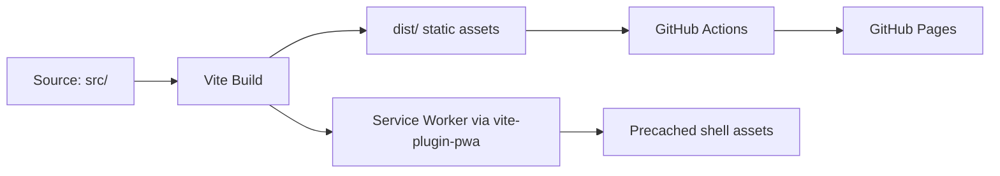

# Deployment — Design

> Status: Accepted
> Accepted by: retroactive documentation
> Accepted on: 2026-06-01

## Overview

Application is a static single-page app built with Vite, deployed to GitHub Pages via Actions, with PWA support for offline access.

## Architecture



## Build Configuration

### vite.config.ts

```typescript
{
  base: env.VITE_BASE || '/',  // Configurable for project-site subpath
  plugins: [
    react(),
    VitePWA({
      registerType: 'autoUpdate',
      devOptions: { enabled: true },
      workbox: {
        globPatterns: ['**/*.{js,css,html,ico,svg,woff,woff2}']
      },
      manifest: {
        name: 'Markdown drop viewer',
        short_name: 'MD View',
        theme_color: '#0f1419',
        background_color: '#0f1419',
        display: 'standalone',
        start_url: '.',
        scope: '.'
      }
    })
  ]
}
```

### Environment Variables

| Variable | Purpose | Default |
|----------|---------|---------|
| `VITE_BASE` | Asset path prefix for hosting | `/` |

## GitHub Actions Workflow

**Trigger:** Push to `main` or `master`, or manual `workflow_dispatch`.

**Steps:**
1. Checkout → setup Node LTS → `npm ci`
2. Build with `VITE_BASE=/${{ repo_name }}/`
3. Upload `dist/` as pages artifact
4. Deploy via `actions/deploy-pages`

**Permissions:** `contents: read`, `pages: write`, `id-token: write`

**Concurrency:** Group `pages`, cancel in-progress.

## PWA Strategy

- **Precaching:** Workbox precaches all static assets at install time
- **Update:** `autoUpdate` — new service worker activates immediately on detection
- **Scope:** Relative (`.`) — aligns with whatever `base` is configured
- **Offline behavior:** App shell loads from cache; IndexedDB data available; remote images may fail (expected)

## Key Decisions

| Decision | Rationale |
|----------|-----------|
| `VITE_BASE` env var (not hardcoded) | Supports both project sites (`/repo/`) and user sites (`/`) |
| `vite-plugin-pwa` over manual SW | Handles manifest generation, precache manifest, and registration |
| `registerType: 'autoUpdate'` | No user prompt needed; seamless updates |
| Dev PWA enabled | Allows testing offline behavior during development |
| Relative `start_url` and `scope` (`.`) | Works regardless of base path without duplication |
