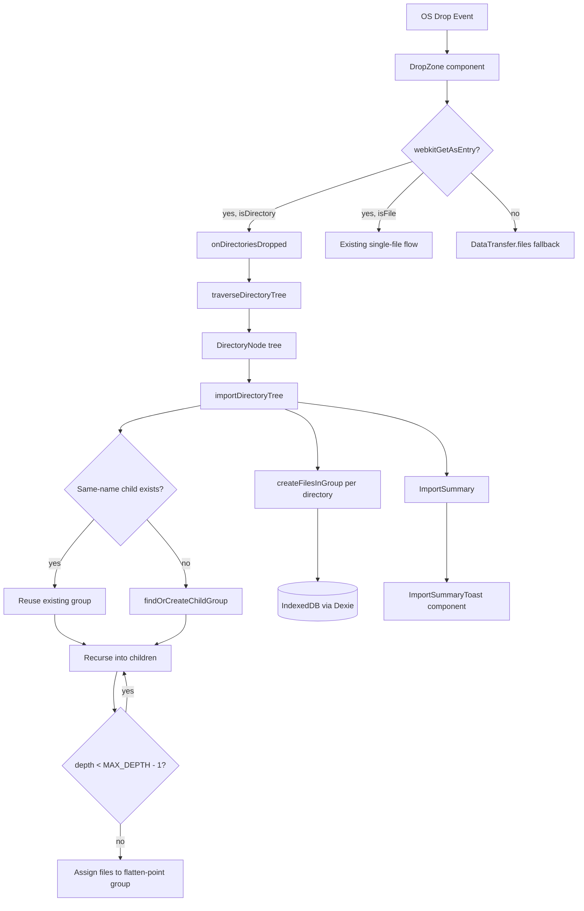
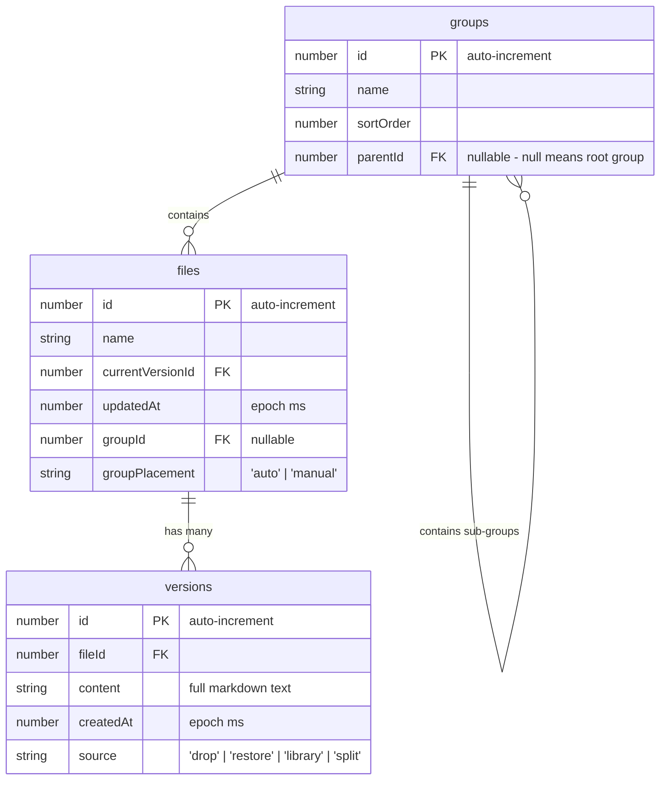

# File Management — Design

> Status: Accepted
> Accepted by: retroactive documentation
> Accepted on: 2026-06-01

## Overview

File management handles the full lifecycle of dropped documents: acceptance, persistence in IndexedDB, library browsing, version history, drag-based organization, and deletion. Groups support hierarchical nesting up to 6 levels deep (depth 0–5) via a nullable `parentId` foreign key, with `MAX_DEPTH = 6` as a named constant. Directory drops perform hierarchical import that mirrors folder structure as nested groups with same-name reuse at every level. Built on Dexie (IndexedDB wrapper) with a React sidebar component that renders nested groups recursively.

## Architecture

```mermaid
flowchart TD
  DROP[OS File Drop] --> DZ[DropZone component]
  DZ --> |File[] callback| APP[App state]
  APP --> |createNewFileFromBrowserDrop| DB[(IndexedDB via Dexie)]
  APP --> |applyRawDocument| PANE[MarkdownPane]

  LIB[FileLibrary sidebar] --> |read| DB
  LIB --> |onOpenVersion| APP
  LIB --> |drag/drop| REORG[moveFileToGroup / detachVersionToNewFile]
  REORG --> DB

  LIB --> |hold-delete| DEL[deleteFileAndVersions / deleteVersionForFile]
  DEL --> DB

  subgraph TreeUtils["Group Tree Utilities (src/db/groupTree.ts)"]
    VALIDATE[validateReparent]
    DEPTH[computeDepth]
    ANCESTORS[getAncestorIds]
    DESCENDANTS[getDescendantIds]
  end

  subgraph GroupOps["Group Operations (src/db/schema.ts)"]
    REPAR[reparentGroup]
    REORD[reorderSiblings]
    CREATE[createChildGroup]
    DELG[deleteGroupWithPromotion]
    MERGE[mergeGroupInto]
  end

  LIB --> |group drop| CLASSIFY{same parentId?}
  CLASSIFY -->|yes| COLLCHECK1{same-name sibling?}
  CLASSIFY -->|no| COLLCHECK2{same-name sibling at target?}
  COLLCHECK1 -->|yes| MERGE
  COLLCHECK1 -->|no| REORD
  COLLCHECK2 -->|yes| MERGE
  COLLCHECK2 -->|no| VALIDATE
  VALIDATE -->|valid| REPAR
  VALIDATE -->|invalid: cycle/depth| NOOP[no-op]
  MERGE --> DB
  REPAR --> DB
  REORD --> DB
  CREATE --> DB
  DELG --> DB
```

### Directory Import Flow



## Data Model

### IndexedDB Schema (Dexie v5)



### Schema Migrations

| Version | Changes |
|---------|---------|
| 1 | Initial: `files` + `versions` tables |
| 2 | Add `groups` table, `groupId` index on files |
| 3 | Add `entryPath` + `groupPlacement` to files (migration sets defaults) |
| 4 | Remove `entryPath` (cleanup), keep `groupPlacement` |
| 5 | Add `parentId` (indexed, nullable) to `groups` table; migration sets `parentId = null` on all existing rows |

### GroupRecord Interface

```typescript
export interface GroupRecord {
  id?: number
  name: string
  sortOrder: number
  parentId: number | null  // null = root group
}
```

### In-Memory Tree Representation

Operations build lookup maps from the flat `groups` array:

```typescript
// Map<groupId, GroupRecord> for O(1) lookup
const byId = new Map<number, GroupRecord>()

// Map<parentId | null, GroupRecord[]> for children lookup
const childrenByParent = new Map<number | null, GroupRecord[]>()
```

These are rebuilt on each library refresh (group count is small, < 100 expected).

## Group Tree Utilities (`src/db/groupTree.ts`)

Pure functions for tree traversal and validation:

```typescript
/** System-wide maximum group nesting depth. Root = 0, deepest allowed = MAX_DEPTH - 1. */
export const MAX_DEPTH = 6

/** Compute depth of a group by traversing parentId chain. */
export function computeDepth(
  groupId: number,
  groupsById: Map<number, GroupRecord>
): number

/** Get all ancestor IDs from group up to root (exclusive of groupId itself). */
export function getAncestorIds(
  groupId: number,
  groupsById: Map<number, GroupRecord>
): number[]

/** Get all descendant IDs (transitive children). */
export function getDescendantIds(
  groupId: number,
  childrenByParent: Map<number | null, GroupRecord[]>
): number[]

/** Validate a reparent operation. Returns null if valid, error string if invalid. */
export function validateReparent(
  groupId: number,
  targetParentId: number | null,
  groupsById: Map<number, GroupRecord>,
  childrenByParent: Map<number | null, GroupRecord[]>
): string | null

/** Build lookup maps from a flat group array. */
export function buildGroupMaps(groups: GroupRecord[]): {
  byId: Map<number, GroupRecord>
  childrenByParent: Map<number | null, GroupRecord[]>
}
```

### Circular Reference Prevention Algorithm

```
validateReparent(groupId, targetParentId):
  if targetParentId === null → valid (moving to root)
  if targetParentId === groupId → invalid (self-reference)

  walk = targetParentId
  while walk !== null:
    if walk === groupId → invalid (target is descendant of group)
    walk = groupsById.get(walk).parentId

  // Depth check: compute depth of target + max subtree depth of group
  targetDepth = computeDepth(targetParentId, groupsById)
  subtreeMaxDepth = maxDescendantDepth(groupId, childrenByParent)
  if (targetDepth + 1 + subtreeMaxDepth) > MAX_DEPTH → invalid (exceeds max depth)

  return valid
```

## Database Operations (`src/db/schema.ts`)

### Reparent

```typescript
/** Reparent a group to a new parent (or root). Atomic transaction. */
export async function reparentGroup(
  groupId: number,
  newParentId: number | null
): Promise<void>
```

Assigns `sortOrder` equal to max among target's existing children + 1.

### Reorder Siblings

```typescript
/** Reorder siblings sharing the same parentId. Atomic transaction. */
export async function reorderSiblings(
  parentId: number | null,
  orderedIds: number[]
): Promise<void>
```

Assigns contiguous `sortOrder` values starting at 0.

### Create Child Group

```typescript
/** Create a child group under a specific parent. */
export async function createChildGroup(
  name: string,
  parentId: number | null
): Promise<number>
```

Rejects empty/whitespace-only names.

### Delete Group with Promotion

```typescript
/** Delete a group, promoting children and files to the deleted group's parent. */
export async function deleteGroupWithPromotion(
  groupId: number
): Promise<{ promotedGroupIds: number[]; promotedFileIds: number[] }>
```

Algorithm:
1. Get the group's `parentId` (promotion target).
2. Reparent all direct child groups to the promotion target.
3. Move all files with `groupId === groupId` to the promotion target.
4. Delete the group record.
5. Recompute contiguous `sortOrder` for the promotion target's children.

All steps execute within a single IndexedDB transaction.

### Merge Group Into (Same-Name Collision)

```typescript
/**
 * Recursively merge a source group's contents into a target group.
 * Used when a group is dropped where a same-name sibling already exists.
 * Single rw transaction on [db.groups, db.files, db.versions].
 */
export async function mergeGroupInto(
  sourceGroupId: number,
  targetGroupId: number
): Promise<void>
```

Algorithm:
1. Load source and target group records.
2. For each file in source group:
   - Find same-name file in target group.
   - If found: reassign all source versions to target file, delete source file, update target's `currentVersionId` to newest.
   - If not found: update file's `groupId` to target, set `groupPlacement` to `'manual'`.
3. For each direct child group of source:
   - Find same-name child group under target.
   - If found: recurse (`mergeGroupInto` inner call).
   - If not found: update child's `parentId` to target, compute `sortOrder`.
4. Delete the now-empty source group.
5. Recompute contiguous `sortOrder` for target's children.

All steps execute within a single IndexedDB transaction. The recursive logic uses an inner function to avoid Dexie nested-transaction conflicts on overlapping table sets.

### Find or Create Child Group

```typescript
/**
 * Find an existing child group by exact name match under a given parent, or create one.
 * - Trims name; rejects empty/whitespace-only (returns null).
 * - Caps name at 255 characters after trimming.
 * - Reuses existing child if name matches (case-sensitive, post-trim) under same parentId.
 * - New groups get sortOrder = max(sibling sortOrders) + 1.
 */
export async function findOrCreateChildGroup(
  dirName: string,
  parentId: number | null
): Promise<{ id: number; created: boolean } | null>
```

The existing `findOrCreateDirectoryGroup(dirName)` is a thin wrapper: `findOrCreateChildGroup(dirName, null)`.

## Directory Import Modules

### `src/lib/directoryTraversal.ts`

Builds an in-memory tree of `DirectoryNode` from a `FileSystemDirectoryEntry` without touching the database.

```typescript
/** A node in the in-memory directory tree. */
export interface DirectoryNode {
  name: string
  files: CollectedFile[]
  children: DirectoryNode[]
}

/** Result of traversal including cap status. */
export interface TraversalResult {
  root: DirectoryNode
  totalFilesFound: number
  capReached: boolean
}

/**
 * Recursively traverse a FileSystemDirectoryEntry, building a DirectoryNode tree.
 * - DFS traversal with depth tracking.
 * - Applies readability filter on files.
 * - Enforces global file cap (default 200) across all levels.
 * - Skips files that fail to read.
 * - Safety max traversal depth of 20 prevents runaway recursion.
 */
export async function traverseDirectoryTree(
  dirEntry: FileSystemDirectoryEntry,
  options?: { maxFiles?: number; maxTraversalDepth?: number }
): Promise<TraversalResult>
```

### `src/lib/importOrchestrator.ts`

Orchestrates group creation and file persistence from a `DirectoryNode` tree.

```typescript
/** Counts returned after import for toast display. */
export interface ImportSummary {
  groupsCreated: number
  groupsReused: number
  filesImported: number
  capReached: boolean
}

/**
 * Import a DirectoryNode tree into the database as nested groups.
 * - Creates/reuses groups recursively via same-name matching.
 * - Flattens files beyond MAX_DEPTH into the deepest allowed group.
 * - Returns summary counts for toast.
 */
export async function importDirectoryTree(
  tree: DirectoryNode,
  options?: { parentId?: number | null }
): Promise<ImportSummary>

/** Gather all files from a DirectoryNode subtree recursively (for flattening). */
export function collectAllFilesDeep(node: DirectoryNode): CollectedFile[]
```

### Hierarchical Import Algorithm

```
importDirectoryTree(tree, { parentId = null }):
  summary = { groupsCreated: 0, groupsReused: 0, filesImported: 0, capReached: false }

  function importNode(node, parentId, currentDepth):
    result = await findOrCreateChildGroup(node.name, parentId)
    if result == null: return  // whitespace name

    if result.created: summary.groupsCreated++
    else: summary.groupsReused++

    groupId = result.id

    if node.files.length > 0:
      await createFilesInGroup(groupId, node.files)
      summary.filesImported += node.files.length

    for child in node.children:
      if currentDepth + 1 >= MAX_DEPTH:
        flatFiles = collectAllFilesDeep(child)
        if flatFiles.length > 0:
          await createFilesInGroup(groupId, flatFiles)
          summary.filesImported += flatFiles.length
      else:
        await importNode(child, groupId, currentDepth + 1)

  await importNode(tree, parentId, parentId === null ? 0 : computeDepth(parentId) + 1)
  return summary
```

## Components

### DropZone

Thin wrapper div with `onDragOver` + `onDrop` handlers. Filters for readable files (`.md`, `.markdown`, `.txt`, `text/markdown`, `text/plain`). Ignores internal library drags via MIME type check. When `webkitGetAsEntry()` is available, classifies each `DataTransferItem`: directories go to `onDirectories` callback, files go to existing `onFiles` callback. Mixed drops fire both callbacks independently.

```typescript
type Props = {
  onFiles: (files: File[]) => void
  onDirectories?: (entries: FileSystemDirectoryEntry[]) => void
  children: ReactNode
  className?: string
}
```

### ImportSummaryToast

Auto-dismissing toast notification rendered after directory import:
- Positioned fixed, bottom-right of viewport
- Auto-dismiss after 4 seconds (CSS transition fade-out)
- Click to dismiss early
- Stacks if multiple imports finish close together
- Message: "Imported {N} groups, {M} files" with "(cap reached)" suffix when applicable

### FileLibrary

Sidebar (`<aside>`) with:
- Toolbar: title + "+ Group" button
- Scrollable section list: Ungrouped + named groups (rendered recursively via `GroupNode`)
- Each section: collapsible, drop target for file/version/group reorder and reparent
- File rows: name, date, history toggle, hold-to-delete
- Expanded history: version list, compare UI
- VersionDiffModal: unified diff display

### GroupNode (recursive)

```typescript
/** Renders a group and its children recursively. */
function GroupNode({
  group,
  depth,
  childrenByParent,
  filesByGroup,
  // ... existing props
}: GroupNodeProps): JSX.Element
```

- Renders its own section, then recursively renders child groups
- Each level adds 16px left padding relative to parent
- Vertical guide lines rendered via CSS `::before` pseudo-elements on nested sections
- Collapse state tracked per group (existing `collapsedSections` set, keyed by group ID)
- Bin icon button for group deletion (no inline create-child action; creation uses global "+ Group" button)

### App (orchestrator)

Holds active state: `markdown`, `fileName`, `activeFileId`, `activeVersionId`, `activeVersionOrdinal`, `frontMatter`, `persistError`, `toasts`. Coordinates between DropZone callbacks, FileLibrary events, and MarkdownPane rendering.

The `onDirectoriesDropped` handler orchestrates directory import:
1. For each dropped directory entry, skip empty/whitespace names
2. Call `traverseDirectoryTree` to build in-memory `DirectoryNode` tree
3. Call `importDirectoryTree` to persist groups and files
4. Show `ImportSummaryToast` with summary counts
5. Render last imported file in the main pane
6. On IndexedDB failure: render last readable file in-memory + show persist warning

## Drag-and-Drop Protocol

Custom MIME types for internal drags (defined in `src/dnd.ts`):

| MIME | Payload | Purpose |
|------|---------|---------|
| `application/x-mdviewer-file-id` | file ID (number as string) | Drag file between groups |
| `application/x-mdviewer-group-id` | group ID (number as string) | Reorder or reparent groups |
| `application/x-mdviewer-version` | `${fileId}:${versionId}` | Detach version to new file |

Detection helpers: `isInternalFileDrag`, `isInternalGroupDrag`, `isInternalVersionDrag`, `isInternalLibraryDrag`.

### Reorder vs Reparent Classification

When a group is dropped:
- Compare the dragged group's current `parentId` with the target section's `parentId`.
- **Before** branching on same/different parent, check for same-name collision at the target level:
  - Look up siblings at `targetParentId`.
  - If a sibling with the same name (case-sensitive) as the source group exists → call `mergeGroupInto(sourceId, sameNameSibling.id)` and return early.
- Same `parentId`, no collision → reorder operation (reassign `sortOrder` among siblings).
- Different `parentId`, no collision → reparent operation (validate via `validateReparent`, then execute `reparentGroup`).

## Key Operations

### Drop Flow

1. `DropZone.onDrop` → filter readable files → call `onFiles(File[])`
2. For each file: read `.text()`, call `createNewFileFromBrowserDrop(name, content)`
3. DB transaction: find/create "Dropped" group → add file record → add version record → update `currentVersionId`
4. `applyRawDocument`: parse frontmatter, set state, render

### Directory Drop Flow

1. `DropZone.onDrop` → detect directory via `webkitGetAsEntry()` → call `onDirectories(FileSystemDirectoryEntry[])`
2. For each directory entry: `traverseDirectoryTree(dirEntry)` → builds `DirectoryNode` tree with file cap (200)
3. `importDirectoryTree(tree)` → recursive walk creating/reusing groups via `findOrCreateChildGroup`, persisting files via `createFilesInGroup`
4. At flatten-point (depth ≥ MAX_DEPTH − 1): `collectAllFilesDeep` gathers child files into current group
5. Returns `ImportSummary` → displayed in `ImportSummaryToast`
6. Last imported file rendered in main pane via `applyRawDocument`

### Merge Flow (same-name file dragged to group)

1. `moveFileToGroup(movingFileId, targetGroupId)`
2. Find existing file with same name in target group
3. If found: reassign all source versions to target file, delete source file, update target's `currentVersionId` to newest
4. If not found: just update `groupId`

### Detach Flow (version dragged out)

1. `detachVersionToNewFile(sourceFileId, versionId, targetGroupId)`
2. Create new file record in target group
3. Update version's `fileId` to new file, set source to `split`
4. If source file has no remaining versions: delete it
5. Otherwise: update source's `currentVersionId` if needed

## Key Decisions

| Decision | Rationale |
|----------|-----------|
| Each drop creates a new file (no auto-merge by name) | Explicit user control; merge only via intentional drag |
| Hold-to-delete (700ms) instead of click | Prevents accidental deletion; no confirmation dialog needed for files/versions |
| Dexie transactions for multi-step operations | Atomic consistency for merge/detach/delete/reparent |
| `groupPlacement: 'auto' | 'manual'` | Distinguish OS-drop placement from user-organized placement |
| Version ordinals computed from chronological order | Simple `v1, v2, ...` labels without storing ordinal in DB |
| Library refresh via `libKey` counter | Simple re-fetch trigger without complex subscription |
| Max depth 6 (depth 0–5 for group creation, `MAX_DEPTH` constant in `groupTree.ts`) | Supports realistically deep folder imports; single constant used across all validation paths |
| `parentId` nullable FK on groups | Minimal schema change; null = root group; backward-compatible with flat groups |
| Subtree travels with reparented group | Only moved group's `parentId` changes; descendants stay intact for predictable behavior |
| Deletion promotes children to parent | No content loss; children and files move up one level rather than being deleted |
| Ancestor traversal for cycle detection | O(depth) validation; walks parentId chain from target to root to detect cycles |
| Same-name group merge on drag-drop | Mirrors the merge-on-collision semantics of directory imports (`findOrCreateChildGroup`) and file moves (`moveFileToGroup`); consistent user mental model across all collision scenarios |
| Single transaction for recursive merge | `mergeGroupInto` uses one `rw` transaction with an inner recursive function to avoid Dexie nested-transaction conflicts while ensuring atomicity |
| Confirmation dialog for nested group deletion | Groups with children/files show count of affected items before destructive action |
| Tree-first traversal for directory import | Separate traversal from DB writes; `traverseDirectoryTree` builds in-memory tree, then `importDirectoryTree` walks it — keeps traversal pure/testable and allows file cap enforcement before any DB work |
| Hierarchical import mirrors folder structure | Dropped directories become nested groups matching their on-disk hierarchy, replacing the earlier flat import |
| Same-name reuse via `findOrCreateChildGroup` | Generalises root-level group reuse to any parent level; queries children of target parent by exact name match |
| Flatten-point at MAX_DEPTH − 1 | When source subdirectories exceed the depth limit, their files land in the deepest allowed group rather than being discarded |
| Import summary toast (4s auto-dismiss) | Non-blocking user feedback after directory import; shows groups + files counts |
| File cap of 200 per directory import | Prevents browser storage from being overwhelmed by large directory drops |

## Error Handling

| Scenario | Handling |
|----------|----------|
| Reparent to self or descendant | `validateReparent` returns error string; UI ignores drop silently |
| Reparent exceeds max depth | `validateReparent` returns error string; UI ignores drop silently |
| Group with invalid parentId (orphan) | Treated as root group (parentId effectively null for rendering) |
| Empty/whitespace group name | `createGroup`/`createChildGroup` throws; caller catches and no-ops |
| IndexedDB transaction failure | Error propagates to caller; no partial state written (Dexie rollback) |
| Concurrent modification | Dexie transaction isolation handles; last writer wins within transaction |
| Same-name group collision on drag-drop | Detected before reorder/reparent branches; triggers recursive merge (files by name, child groups by name, source deleted) — no user prompt needed, behavior is deterministic |
| IndexedDB unavailable on drop | Content still renders; non-blocking warning displayed |
| Directory name empty/whitespace after trim | No groups created, no files imported, no toast |
| Individual file read failure during import | Skip that file, continue importing remaining files |
| All files in directory fail to read | Groups still created (empty); toast shows "0 files" |
| Subdirectory at depth ≥ MAX_DEPTH | Files flattened into deepest allowed group (depth MAX_DEPTH − 1) |
| File cap (200) reached mid-traversal | Stop collecting files; continue traversing for group creation; toast indicates cap |
| `webkitGetAsEntry()` unavailable | Fall back to DataTransfer.files; directories silently skipped |
