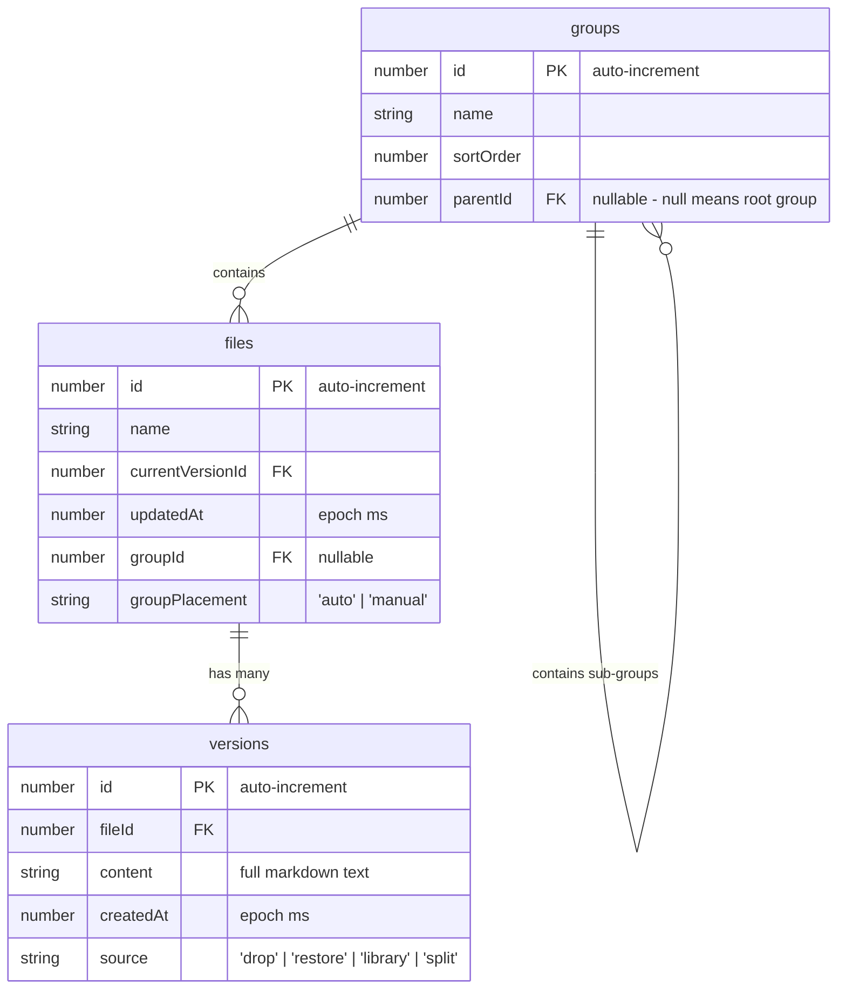

# File Management — Design

> Status: Accepted
> Accepted by: retroactive documentation
> Accepted on: 2026-06-01

## Overview

File management handles the full lifecycle of dropped documents: acceptance, persistence in IndexedDB, library browsing, version history, drag-based organization, and deletion. Groups support hierarchical nesting up to 4 levels deep (depth 0–3) via a nullable `parentId` foreign key. Built on Dexie (IndexedDB wrapper) with a React sidebar component that renders nested groups recursively.

## Architecture

```mermaid
flowchart TD
  DROP[OS File Drop] --> DZ[DropZone component]
  DZ --> |File[] callback| APP[App state]
  APP --> |createNewFileFromBrowserDrop| DB[(IndexedDB via Dexie)]
  APP --> |applyRawDocument| PANE[MarkdownPane]

  LIB[FileLibrary sidebar] --> |read| DB
  LIB --> |onOpenVersion| APP
  LIB --> |drag/drop| REORG[moveFileToGroup / detachVersionToNewFile]
  REORG --> DB

  LIB --> |hold-delete| DEL[deleteFileAndVersions / deleteVersionForFile]
  DEL --> DB

  subgraph TreeUtils["Group Tree Utilities (src/db/groupTree.ts)"]
    VALIDATE[validateReparent]
    DEPTH[computeDepth]
    ANCESTORS[getAncestorIds]
    DESCENDANTS[getDescendantIds]
  end

  subgraph GroupOps["Group Operations (src/db/schema.ts)"]
    REPAR[reparentGroup]
    REORD[reorderSiblings]
    CREATE[createChildGroup]
    DELG[deleteGroupWithPromotion]
  end

  LIB --> |group drop| CLASSIFY{same parentId?}
  CLASSIFY -->|yes| REORD
  CLASSIFY -->|no| VALIDATE
  VALIDATE -->|valid| REPAR
  VALIDATE -->|invalid: cycle/depth| NOOP[no-op]
  REPAR --> DB
  REORD --> DB
  CREATE --> DB
  DELG --> DB
```

## Data Model

### IndexedDB Schema (Dexie v5)



### Schema Migrations

| Version | Changes |
|---------|---------|
| 1 | Initial: `files` + `versions` tables |
| 2 | Add `groups` table, `groupId` index on files |
| 3 | Add `entryPath` + `groupPlacement` to files (migration sets defaults) |
| 4 | Remove `entryPath` (cleanup), keep `groupPlacement` |
| 5 | Add `parentId` (indexed, nullable) to `groups` table; migration sets `parentId = null` on all existing rows |

### GroupRecord Interface

```typescript
export interface GroupRecord {
  id?: number
  name: string
  sortOrder: number
  parentId: number | null  // null = root group
}
```

### In-Memory Tree Representation

Operations build lookup maps from the flat `groups` array:

```typescript
// Map<groupId, GroupRecord> for O(1) lookup
const byId = new Map<number, GroupRecord>()

// Map<parentId | null, GroupRecord[]> for children lookup
const childrenByParent = new Map<number | null, GroupRecord[]>()
```

These are rebuilt on each library refresh (group count is small, < 100 expected).

## Group Tree Utilities (`src/db/groupTree.ts`)

Pure functions for tree traversal and validation:

```typescript
/** Compute depth of a group by traversing parentId chain. */
export function computeDepth(
  groupId: number,
  groupsById: Map<number, GroupRecord>
): number

/** Get all ancestor IDs from group up to root (exclusive of groupId itself). */
export function getAncestorIds(
  groupId: number,
  groupsById: Map<number, GroupRecord>
): number[]

/** Get all descendant IDs (transitive children). */
export function getDescendantIds(
  groupId: number,
  childrenByParent: Map<number | null, GroupRecord[]>
): number[]

/** Validate a reparent operation. Returns null if valid, error string if invalid. */
export function validateReparent(
  groupId: number,
  targetParentId: number | null,
  groupsById: Map<number, GroupRecord>,
  childrenByParent: Map<number | null, GroupRecord[]>
): string | null

/** Build lookup maps from a flat group array. */
export function buildGroupMaps(groups: GroupRecord[]): {
  byId: Map<number, GroupRecord>
  childrenByParent: Map<number | null, GroupRecord[]>
}
```

### Circular Reference Prevention Algorithm

```
validateReparent(groupId, targetParentId):
  if targetParentId === null → valid (moving to root)
  if targetParentId === groupId → invalid (self-reference)

  walk = targetParentId
  while walk !== null:
    if walk === groupId → invalid (target is descendant of group)
    walk = groupsById.get(walk).parentId

  // Depth check: compute depth of target + max subtree depth of group
  targetDepth = computeDepth(targetParentId, groupsById)
  subtreeMaxDepth = maxDescendantDepth(groupId, childrenByParent)
  if (targetDepth + 1 + subtreeMaxDepth) > 3 → invalid (exceeds max depth)

  return valid
```

## Database Operations (`src/db/schema.ts`)

### Reparent

```typescript
/** Reparent a group to a new parent (or root). Atomic transaction. */
export async function reparentGroup(
  groupId: number,
  newParentId: number | null
): Promise<void>
```

Assigns `sortOrder` equal to max among target's existing children + 1.

### Reorder Siblings

```typescript
/** Reorder siblings sharing the same parentId. Atomic transaction. */
export async function reorderSiblings(
  parentId: number | null,
  orderedIds: number[]
): Promise<void>
```

Assigns contiguous `sortOrder` values starting at 0.

### Create Child Group

```typescript
/** Create a child group under a specific parent. */
export async function createChildGroup(
  name: string,
  parentId: number | null
): Promise<number>
```

Rejects empty/whitespace-only names.

### Delete Group with Promotion

```typescript
/** Delete a group, promoting children and files to the deleted group's parent. */
export async function deleteGroupWithPromotion(
  groupId: number
): Promise<{ promotedGroupIds: number[]; promotedFileIds: number[] }>
```

Algorithm:
1. Get the group's `parentId` (promotion target).
2. Reparent all direct child groups to the promotion target.
3. Move all files with `groupId === groupId` to the promotion target.
4. Delete the group record.
5. Recompute contiguous `sortOrder` for the promotion target's children.

All steps execute within a single IndexedDB transaction.

## Components

### DropZone

Thin wrapper div with `onDragOver` + `onDrop` handlers. Filters for readable files (`.md`, `.markdown`, `.txt`, `text/markdown`, `text/plain`). Ignores internal library drags via MIME type check.

### FileLibrary

Sidebar (`<aside>`) with:
- Toolbar: title + "+ Group" button
- Scrollable section list: Ungrouped + named groups (rendered recursively via `GroupNode`)
- Each section: collapsible, drop target for file/version/group reorder and reparent
- File rows: name, date, history toggle, hold-to-delete
- Expanded history: version list, compare UI
- VersionDiffModal: unified diff display

### GroupNode (recursive)

```typescript
/** Renders a group and its children recursively. */
function GroupNode({
  group,
  depth,
  childrenByParent,
  filesByGroup,
  // ... existing props
}: GroupNodeProps): JSX.Element
```

- Renders its own section, then recursively renders child groups
- Each level adds 16px left padding relative to parent
- Vertical guide lines rendered via CSS `::before` pseudo-elements on nested sections
- Collapse state tracked per group (existing `collapsedSections` set, keyed by group ID)
- "Create child group" context action shown on groups at depth < 3 (max depth 2)

### App (orchestrator)

Holds active state: `markdown`, `fileName`, `activeFileId`, `activeVersionId`, `activeVersionOrdinal`, `frontMatter`, `persistError`. Coordinates between DropZone callbacks, FileLibrary events, and MarkdownPane rendering.

## Drag-and-Drop Protocol

Custom MIME types for internal drags (defined in `src/dnd.ts`):

| MIME | Payload | Purpose |
|------|---------|---------|
| `application/x-mdviewer-file-id` | file ID (number as string) | Drag file between groups |
| `application/x-mdviewer-group-id` | group ID (number as string) | Reorder or reparent groups |
| `application/x-mdviewer-version` | `${fileId}:${versionId}` | Detach version to new file |

Detection helpers: `isInternalFileDrag`, `isInternalGroupDrag`, `isInternalVersionDrag`, `isInternalLibraryDrag`.

### Reorder vs Reparent Classification

When a group is dropped:
- Compare the dragged group's current `parentId` with the target section's `parentId`.
- Same `parentId` → reorder operation (reassign `sortOrder` among siblings).
- Different `parentId` → reparent operation (validate via `validateReparent`, then execute `reparentGroup`).

## Key Operations

### Drop Flow

1. `DropZone.onDrop` → filter readable files → call `onFiles(File[])`
2. For each file: read `.text()`, call `createNewFileFromBrowserDrop(name, content)`
3. DB transaction: find/create "Dropped" group → add file record → add version record → update `currentVersionId`
4. `applyRawDocument`: parse frontmatter, set state, render

### Merge Flow (same-name file dragged to group)

1. `moveFileToGroup(movingFileId, targetGroupId)`
2. Find existing file with same name in target group
3. If found: reassign all source versions to target file, delete source file, update target's `currentVersionId` to newest
4. If not found: just update `groupId`

### Detach Flow (version dragged out)

1. `detachVersionToNewFile(sourceFileId, versionId, targetGroupId)`
2. Create new file record in target group
3. Update version's `fileId` to new file, set source to `split`
4. If source file has no remaining versions: delete it
5. Otherwise: update source's `currentVersionId` if needed

## Key Decisions

| Decision | Rationale |
|----------|-----------|
| Each drop creates a new file (no auto-merge by name) | Explicit user control; merge only via intentional drag |
| Hold-to-delete (700ms) instead of click | Prevents accidental deletion; no confirmation dialog needed for files/versions |
| Dexie transactions for multi-step operations | Atomic consistency for merge/detach/delete/reparent |
| `groupPlacement: 'auto' | 'manual'` | Distinguish OS-drop placement from user-organized placement |
| Version ordinals computed from chronological order | Simple `v1, v2, ...` labels without storing ordinal in DB |
| Library refresh via `libKey` counter | Simple re-fetch trigger without complex subscription |
| Max depth 3 (depth 0–2 for group creation) | Balances organizational flexibility with UI complexity; prevents deeply nested trees |
| `parentId` nullable FK on groups | Minimal schema change; null = root group; backward-compatible with flat groups |
| Subtree travels with reparented group | Only moved group's `parentId` changes; descendants stay intact for predictable behavior |
| Deletion promotes children to parent | No content loss; children and files move up one level rather than being deleted |
| Ancestor traversal for cycle detection | O(depth) validation; walks parentId chain from target to root to detect cycles |
| Confirmation dialog for nested group deletion | Groups with children/files show count of affected items before destructive action |

## Error Handling

| Scenario | Handling |
|----------|----------|
| Reparent to self or descendant | `validateReparent` returns error string; UI ignores drop silently |
| Reparent exceeds max depth | `validateReparent` returns error string; UI ignores drop silently |
| Group with invalid parentId (orphan) | Treated as root group (parentId effectively null for rendering) |
| Empty/whitespace group name | `createGroup`/`createChildGroup` throws; caller catches and no-ops |
| IndexedDB transaction failure | Error propagates to caller; no partial state written (Dexie rollback) |
| Concurrent modification | Dexie transaction isolation handles; last writer wins within transaction |
| IndexedDB unavailable on drop | Content still renders; non-blocking warning displayed |
