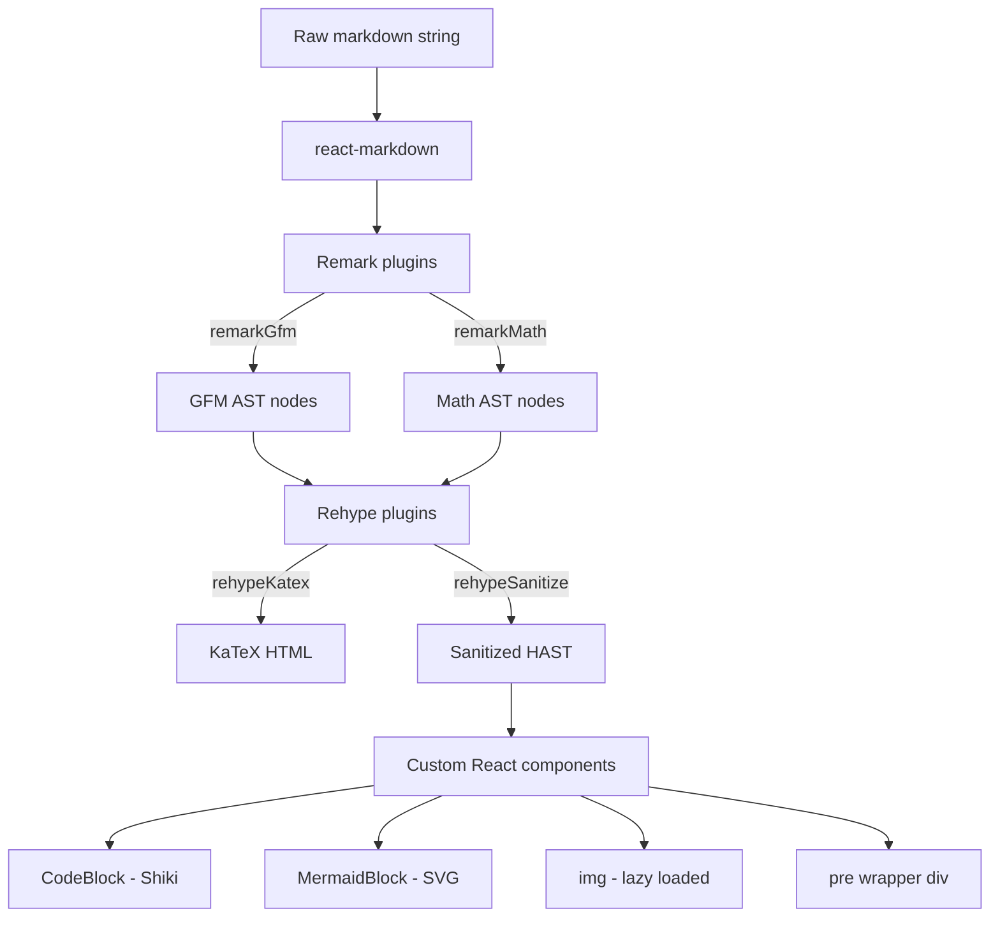

# Markdown Rendering — Design

> Status: Accepted
> Accepted by: retroactive documentation
> Accepted on: 2026-06-01

## Overview

Rendering pipeline transforms raw markdown text into safe, richly-formatted HTML using a remark/rehype plugin chain inside `react-markdown`. Custom components handle code highlighting (Shiki), diagrams (Mermaid), and images.

## Architecture



## Components

### MarkdownPane

Entry point. Accepts `markdown: string` and `useDarkShiki: boolean`. Builds memoized component map and plugin arrays. Renders `<ReactMarkdown>` inside an `<article class="markdown-body">`.

### CodeBlock

Async Shiki highlighter. On mount/update, calls `codeToHtml(code, { lang, theme })`. Falls back to `log` language on unknown lang error, then to escaped `<pre>` on total failure. Language aliases normalized via static map.

### MermaidBlock

Two-phase rendering:
1. **Inline** — `MermaidSvgMount` calls `mermaid.render()` in a `useLayoutEffect`, injects SVG into a container div. Clickable to open lightbox.
2. **Lightbox** — `<dialog>` with `MermaidLightboxContent`: independent Mermaid render at natural size, CSS `transform: scale()` for zoom, `ResizeObserver` for natural dimensions, scroll viewport with spacer div.

Mermaid initialized once (module-level flag). Theme set from `prefers-color-scheme` at init time.

### sanitizeSchema

Extends `hast-util-sanitize` `defaultSchema`:
- Adds MathML tag names for KaTeX output
- Allows `span.className` matching `/^katex/` + `style`
- Extends `src` protocol list with `data` and `blob`

## Plugin Order

1. `remarkGfm` (singleTilde: false)
2. `remarkMath` (singleDollarTextMath: true)
3. `rehypeKatex` (errorColor: CSS var, strict: 'ignore')
4. `rehypeSanitize` (custom schema — runs last on final HAST)

## Key Decisions

| Decision | Rationale |
|----------|-----------|
| Shiki via custom `code` component (not rehype plugin) | Avoids double-processing; async rendering per-block |
| Mermaid with `securityLevel: 'loose'` | Required for click handlers and interactive diagrams |
| `rehypeSanitize` last in pipeline | Ensures all generated HTML (KaTeX output) is cleaned |
| Lightbox uses native `<dialog>` | Built-in modal behavior, Escape handling, backdrop |
| Language alias map in CodeBlock | Handles common AI output variations without Shiki config |

## Data Contracts

### MarkdownPane Props

```typescript
type PaneProps = {
  markdown: string      // Raw markdown body (frontmatter already stripped)
  useDarkShiki: boolean // true → github-dark theme, false → github-light
}
```

### CodeBlock Props

```typescript
type Props = {
  language: string                        // Info string from fence
  code: string                            // Code content (trailing newline stripped)
  theme: 'github-dark' | 'github-light'
}
```

### MermaidBlock Props

```typescript
type Props = { code: string }  // Mermaid diagram source
```
