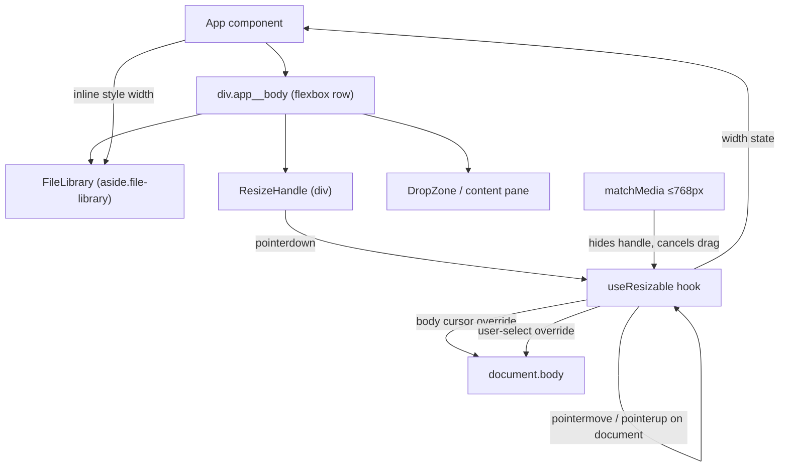

# Resizable Sidebar — Design

> Status: Accepted
> Accepted by: implementation complete
> Accepted on: 2026-06-03

## Overview

A draggable resize handle between the FileLibrary sidebar and the main content pane lets users adjust the sidebar width via pointer drag or keyboard arrows, with clamping to sensible bounds. On narrow viewports (≤ 768px) the handle is removed and the existing stacked layout takes over.

The implementation consists of a `ResizeHandle` component rendered between the sidebar and content pane in App.tsx, and a `useResizable` hook that encapsulates the resize state machine (idle → dragging → idle). The sidebar's container width is driven externally via inline style; no changes to FileLibrary internals.

## Architecture



### Integration with existing layout

`.app__body` uses `display: flex`. The sidebar CSS uses `width: var(--sidebar-width, 17rem)` as a fallback. The hook-driven inline `style={{ width }}` overrides this at runtime. Mobile media query uses `width: 100% !important` to override inline style on narrow viewports.

## Components and Interfaces

### `useResizable` hook (`src/components/resize/useResizable.ts`)

```typescript
interface UseResizableOptions {
  defaultWidth: number       // 272
  minWidth: number           // 120
  maxWidthRatio: number      // 0.5
}

interface UseResizableReturn {
  width: number
  isDragging: boolean
  isMobile: boolean
  handleProps: {
    onPointerDown: (e: React.PointerEvent) => void
    onKeyDown: (e: React.KeyboardEvent) => void
    tabIndex: number
    role: string
    'aria-orientation': 'vertical' | 'horizontal'
    'aria-valuemin': number
    'aria-valuemax': number
    'aria-valuenow': number
    'aria-label': string
  }
}
```

**State machine:**
- `idle`: no pointer capture, no document listeners
- `dragging`: pointer captured, document-level `pointermove` + `pointerup` + `pointercancel` listeners attached, body cursor set to `col-resize`, body `user-select` set to `none`

**Mobile breakpoint:** `matchMedia('(max-width: 768px)')` listener cancels active drag on transition to mobile and exposes `isMobile` boolean.

**Keyboard:** ArrowLeft/Right adjusts width by `KEYBOARD_STEP` (10px); Shift+Arrow adjusts by `KEYBOARD_STEP_LARGE` (50px). All clamped.

### Width calculation (pure) (`src/components/resize/clampWidth.ts`)

```typescript
function clampWidth(raw: number, min: number, max: number): number {
  return Math.min(max, Math.max(min, raw))
}

function computeWidth(
  pointerX: number,
  dragStartOffset: number,
  minWidth: number,
  maxWidth: number
): number {
  return clampWidth(pointerX - dragStartOffset, minWidth, maxWidth)
}
```

`dragStartOffset` = `pointerX_at_start - sidebar_width_at_start`, preserving the pointer's position within the handle.

### `ResizeHandle` component (`src/components/resize/ResizeHandle.tsx`)

```typescript
interface ResizeHandleProps {
  isDragging: boolean
  isMobile: boolean
  handleProps: UseResizableReturn['handleProps']
}
```

Renders a `<div>` with class `resize-handle` and modifier `resize-handle--active` when dragging. Returns `null` when `isMobile` is true.

### App.tsx integration

```tsx
const { width, isDragging, isMobile, handleProps } = useResizable({
  defaultWidth: 272,
  minWidth: 120,
  maxWidthRatio: 0.5,
})

<div className="app__body">
  <FileLibrary style={{ width }} ... />
  <ResizeHandle isDragging={isDragging} isMobile={isMobile} handleProps={handleProps} />
  <DropZone ... />
</div>
```

FileLibrary accepts an optional `style?: React.CSSProperties` prop spread onto its `<aside>` element.

## Data Models

No persistent data model changes. The sidebar width is ephemeral React state (not stored in IndexedDB or localStorage). Each page load starts at the default 272px.

### Constants (`src/components/resize/constants.ts`)

| Name | Value | Source |
|------|-------|--------|
| `DEFAULT_WIDTH` | 272 | 17rem × 16px base |
| `MIN_WIDTH` | 120 | Requirement 4.1 |
| `MAX_WIDTH_RATIO` | 0.5 | Requirement 4.2 |
| `KEYBOARD_STEP` | 10 | Requirement 7.3 |
| `KEYBOARD_STEP_LARGE` | 50 | Requirement 7.4 |
| `MOBILE_BREAKPOINT` | 768 | Requirement 6.1 |

## Correctness Properties

### Property 1: Width calculation tracks pointer with offset

For any pointer X position and any initial drag offset, `computeWidth(pointerX, offset, min, max)` produces a value equal to `clamp(pointerX - offset, min, max)`.

### Property 2: Width bounds invariant

For any resize operation (pointer drag, arrow key, shift+arrow key), the resulting sidebar width is always within `[MIN_WIDTH, floor(bodyWidth × MAX_WIDTH_RATIO)]`.

### Property 3: Keyboard resize delta correctness

For any valid starting width `w` and step size `s` (10 or 50), pressing the increase key produces `clamp(w + s, min, max)` and pressing the decrease key produces `clamp(w - s, min, max)`.

## CSS

### Resize handle styles (in `src/App.css`)

- `.resize-handle`: 2px visible width + 3px padding each side = 8px hit area, `flex-shrink: 0`, `cursor: col-resize`, `align-self: stretch`, `touch-action: none`, `background-clip: content-box`
- `.resize-handle:hover` / `.resize-handle--active`: highlighted background via `color-mix`
- `@media (max-width: 48rem)`: defensive `display: none`

### Sidebar CSS changes

- `.file-library`: `width: var(--sidebar-width, 17rem)`, `flex-shrink: 0` (inline style from hook overrides)
- Mobile `@media (max-width: 48rem)`: `width: 100% !important` overrides inline style

## Error Handling

| Scenario | Handling |
|----------|----------|
| Pointer events not supported | Handle renders but drag does nothing; keyboard resize still works |
| Body width is 0 | `maxWidth` falls back to `Infinity`; only `minWidth` clamp applies |
| Viewport resizes during drag to ≤ 768px | `matchMedia` listener cancels drag, handle unmounts, mobile layout activates |
| Pointer leaves window during drag | `pointercancel`/`pointerup` on document ends drag; width stays at last value |
| Multiple rapid pointer events | React state coalesces within the same frame; no batching issues |

## Key Decisions

| Decision | Rationale |
|----------|-----------|
| Ephemeral state (no persistence) | Width resets each page load; simple MVP without localStorage complexity |
| Inline style for width | Instant update per frame; avoids CSS custom property indirection |
| Pointer capture + document listeners | Reliable drag tracking even when pointer leaves handle element |
| `matchMedia` for mobile detection | Declarative; matches existing CSS breakpoint; auto-cancels drag on transition |
| Pure `clampWidth`/`computeWidth` functions | Testable via property-based tests; no side effects |
| 8px hit area via padding | Comfortable targeting while keeping visible element slim (2px) |
